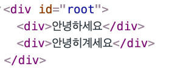

# 🧐 1. JSX란?

**J**ava**S**cript e**X**tension의 줄임말로 HTML 처럼 보이지만 JavaScript의 확장버전이고 JavaScript입니다.

쉽게 말해 HTML 문법을 JavaScript 코드 내부에 쓸 수 있도록 만든 것이죠.

외관상으로는 HTML과 같은 모양을 띄고 있지만, 빌드시 Babel을 통해 JavaScript로 변환되는 과정을 거치게 됩니다.

코드를 보게 되면,

```jsx
// JSX 표기

function Hello() {
  return <div>Hello React!</div>;
}
```

위의 코드는 Babel을 통해 다음과 같이 변환됩니다.

```jsx
function Hello() {
  return React.createElement('div', null, 'Hello React!');
}
```

JSX를 활용한 코드가 훨씬 직관적인 것을 볼 수 있죠!

이처럼 JavaScript 내부에서 쉽게 HTML을 코드를 작성하도록 도와주는 도구가 JSX라고 할 수 있겠습니다.

# 2. JSX 문법

## 2-1. 태그는 반드시 닫혀야 한다.

JSX 작성시 태그는 꼭 닫혀있어야 합니다.
HTML에서 `input` 또는 `br` 태그를 사용 할 때 닫지 않고 사용하기도 하지만,
리액트에서는 **반드시 닫아주어야 합니다**.

```jsx
// 잘못된 예시

import React from 'react';
import Hello from './Hello';

function App() {
  return (
    <div>
      <Hello />
      <Hello />
      <Hello />
      <input>
      <br>
    </div>
  );
}

export default App;
```

`input`과 `br`태그가 닫혀있지 않은 모습. 이렇게 쓰면 안됩니다.

```jsx
import React from 'react';
import Hello from './Hello';

function App() {
  return (
    <div>
      <Hello />
      <Hello />
      <Hello />
      <input />
      <br />
    </div>
  );
}

export default App;
```

`input` 과 `br`태그도 잘 닫혀있는 모습. 이 외에도 모든 태그들을 잘 닫는 것이 중요하겠습니다!

## 2-2. 태그들을 반드시 wrapping 해야한다.

JSX에서 두 개 이상의 요소가 있다면 반드시 부모 요소 하나가 감싸는 형태여야 합니다.

```jsx
function App(){
    return(
      <h1>테스트1</h1>
      <h2>테스트2</h2>
    );
}
```

위의 코드는 요소가 두 개 이상이기 때문에 그것을 감싸는 요소가 필요합니다.
다시 말해, 위의 코드는 에러가 발생합니다.

```jsx
function App() {
  return (
    <div>
      <h1>테스트1</h1>
      <h2>테스트2</h2>
    </div>
  );
}
```

`div` 태그로 요소들을 감싸준 모습입니다. 이렇게 요소 전체를 감싸는 부모요소가 있어야 에러가 나지 않습니다.

> **Q. 왜 전체를 감싸주어야 할까요?**
>
> 리액트가 사용하는 Virtual DOM 방식에서는 컴포넌트 변화를 감지할 때 효율적으로 비교하고자 **컴포넌트 내부는 하나의 DOM 트리 구조로 이루어져야 한다는 규칙**이 있기 때문입니다.
>
> 더 알아보기: https://code-masterjung.tistory.com/33

하지만, 단순히 감싸기 위한 `div`태그의 사용은 그다지 바람직 하지 않을 수 있습니다. 굳이 부모요소로 감쌀 필요가 없는데 리액트의 규칙 때문에 불가피하게 감싸야 할 경우에는 **Fragment**를 사용하면 됩니다.

```jsx
import React from 'react';
import Hello from './Hello';

function App() {
  return (
    <>
      <Hello />
      <div>안녕히계세요</div>
    </>
  );
}

export default App;
```

이렇게 작성하게 되면 오류도 나지 않고 브라우저 상에서 별도의 엘리먼트로 나타나지도 않게 됩니다. 편하네요!



## 2-3. JSX에서 자바스크립트 값을 사용할 땐 `{}`

자바스크립트 변수를 JSX에서 사용하려면 `{...}` 로 감싸서 사용하면 됩니다.

```jsx
import React from 'react';
import Hello from './Hello';

function App() {
  const name = 'react';
  return (
    <>
      <Hello />
      <div>{name}</div>
    </>
  );
}

export default App;
```

중괄호 안에는 이 뿐만 아니라 유효한 모든 자바스크립트의 표현식을 삽입할 수 있습니다!

ex) `2+2`, `user.firstName` ...

## 2-4. JSX도 JavaScript의 객체이다.

컴파일이 끝나면, JSX 표현식이 정규 자바스크립트 함수 호출이 되고 JavaScript 객체로 인식됩니다.

따라서 JSX를 if, for loop, 변수에 할당, 인자로 받기, 함수로 반환 할 수 있습니다.

```jsx
function getGreeting(user) {
  if (user) {
    return <h1>Hello, {user}!</h1>;
  }
  return <h1>Hello, Stranger.</h1>;
}
```

위와 같은 상황에서 `user`를 `getGreeting`에서

받게 되면 **(Hello, user!)**

받지 못 했다면 **(Hello, Stranger.)**를 리턴하게 되겠죠?

## 2-5. JSX 속성 정의는 `""`와 `{}`사용 (+ camelCase)

JSX에서 속성을 사용하는 방법은 두가지입니다.

1. `""` 사용, 속성에 따옴표를 사용해 문자열 리터럴이 사용이 가능합니다.
   `const element = <div className="container" tabIndex="0"></div>;`
2. `{}` 사용, 속성에 중괄호를 사용해 자바스크립트 표현식을 사용할 수 있습니다.
   `const element = </img>;`

> **Q. HTML과 CSS와는 속성, 속성값 이름이 좀 다른데요?**
>
> JSX는 기본적으로 자바스크립트이기 때문에 HTML 속성 이나 >CSS 속성이름 대신에 **camelCase 프로퍼티** 명명 규칙을 사용합니다.
>
> 예를 들어, `class`는 `className`이 되며 `tabindex`는 `tabIndex`가 되며 `background-color`처럼 `-`로 구분되어 있는 이름들은 `backgroundColor`처럼 네이밍해줘야 합니다.

## 2-6. 스타일 적용 방법(객체로 적용, className 활용)

- **객체로 적용**

인라인 스타일을 적용하려면 객체로 작성해야 합니다.

```jsx
function App() {
  const style = {
    backgroundColor: 'black',
    color: 'aqua',
    fontSize: 24, // 기본 단위 px
    padding: '1rem', // 다른 단위 사용 시 문자열로 설정
  };

  return (
    <>
      <Hello />
      <div style={style}>{name}</div>
    </>
  );
}
```

- **class로 적용**

당연히도 CSS 파일을 `import` 해서도 style 적용이 가능합니다.

```css
/* App.css */

.gray-box {
  background: gray;
  width: 64px;
  height: 64px;
}
```

위의 `App.css` 파일의 `.gray-box` style을 불러오고 싶다면,

```jsx
import React from 'react';
import './App.css';

function App() {
  return <div className="gray-box"></div>;
}

export default App;
```

와 같이 import로 CSS 파일을 불러온 후, className을 작성하여 sytle을 불러올 수 있습니다.

## 2-7. JSX 내부 주석은 `{/* ... */}`, `//`

JSX 내부의 주석은 일반적으로 `{/* 이런 형태로 */}` 작성하게 됩니다.

추가로 열리는 태그 내부에서 `//` 형태로도 주석 작성이 가능합니다!

```jsx
function App()
  const name = "react";
  return (
    <>
      {/* 이 주석은 화면에 보이지 않습니다 */}
      <div
        className="react" // 열리는 태그 내부에서는 이렇게 주석을 작성 할 수 있습니다.
      >
        {name}
      </div>
      // 하지만 이런 주석이나 /* 이런 주석은 페이지에 그대로 나타납니다 */
    </>
  );
}
```

# 3. 정리

긴 글 읽느라 고생하셨습니다!
JSX 문법의 소제목들은 그 내용을 한 문장으로 축약할 수 있도록 지어봤습니다.
하단의 7가지 소주제를 읽고 막힘 없이 넘어갈 수 있다면 공부를 끝내도 좋을 것 같습니다! 짝짝짝~~ 🥳

부족한 점이나 궁금하신 점이 있다면 꼭 말씀해 주세요! 감사합니다.

> 1.  태그는 반드시 닫혀야 한다.
> 2.  태그들을 반드시 wrapping 해야 한다.
> 3.  JSX에서 자바스크립트 값을 사용할 땐 `{}`
> 4.  JSX도 자바스크립트의 객체이다.
> 5.  JSX 속성 정의는 `""`와 `{}` 사용 (+ camelCase)
> 6.  스타일 적용 방법 (객체로 적용, `className` 활용)
> 7.  JSX 내부 주석은 `{/* ... */}` , `//`

- 참조

---

1. [https://react.vlpt.us/basic/04-jsx.html](https://react.vlpt.us/basic/04-jsx.html)
2. [https://chanhuiseok.github.io/posts/react-3/](https://chanhuiseok.github.io/posts/react-3/)
3. [https://hello-bryan.tistory.com/114](https://hello-bryan.tistory.com/114)
4. [https://velog.io/@yjs3819/React-JSX](https://velog.io/@yjs3819/React-JSX)
5. [https://github.com/Quickeely/react-basic-study-202103/blob/master/01-jsx%26elementRendering.md](https://github.com/Quickeely/react-basic-study-202103/blob/master/01-jsx%26elementRendering.md)
6. [https://ko.reactjs.org/docs/introducing-jsx.html](https://ko.reactjs.org/docs/introducing-jsx.html)
