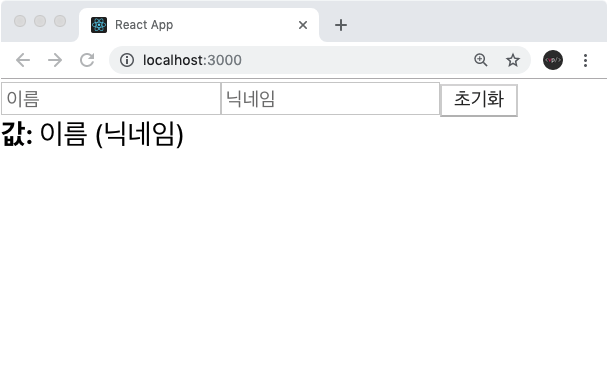

# 1. 폼

`div`, `section`,`span` 등의 보통의 HTML 태그들은 별도의 state를 가지지 않습니다.

하지만 HTML의 폼 엘리먼트들(`input`, `select`, `textarea`...)은 각자의 내부 상태를 가지고 있습니다.

기본 HTML에서는 submit을 하면 폼의 정보와 함께 새로운 페이지로 전달하는 기본 동작을 가지고 있는데, 이렇게 쓰면 React 속에서 데이터의 처리가 되지 않는다.

React 내에서 폼 태그들의 데이터에 접근하여 제어하고 싶다면 React내의 state를 폼 태그와 연결시켜 폼 태그들의 상태를 관리할 수 있게 됩니다.

더 알아보기: [https://ko.reactjs.org/docs/forms.html](https://ko.reactjs.org/docs/forms.html)

# 2. input 상태 관리하기

### InputSample.js

```jsx
import React, { useState } from 'react';

function InputSample() {
  const [text, setText] = useState('');

//e.target은 change event가 발생된 DOM을 가르킴.
//따라서 input의 value(input에 입력된 값)를 text state에 업데이트 해줌.
  const onChange = (e) => {
    setText(e.target.value);
  };

  const onReset = () => {
    setText('');
  };

  return (
    <div>
      <input onChange={onChange} **value={text}**  />
      <button onClick={onReset}>초기화</button>
      <div>
        <b>값: {text}</b>
      </div>
    </div>
  );
}

export default InputSample;
```

`input`의 입력값이 하단에 출력되고, 초기화 버튼을 누르면 `input`이 비워지도록 구현한 코드입니다.

`value={text}`를 넣어야 `onChange` 함수에서 `input` 내부의 입력값을 조회할 수 있습니다.

# 3. 여러개의 input 상태 관리하기



> Q. 위와 같이 `input`의 개수가 여러개가 되었을때는, 어떻게 해야 할까요?
>
> 1.  `useState`, 이벤트 함수를 여러개 만들어서 구현한다.
> 2.  `input`에 `name`을 설정하고 이벤트가 발생했을 때 이 값을 참조한다.

물론 1번의 경우도 충분히 기능 구현이 가능하겠지만 다루어야 할 input의 개수가 3개가 아니라 100개 혹은 1,000개라면? 1번의 방법으로 모든 input에 다른 state를 관리해주어야 한다면 유지보수에 굉장히 힘들 것 같습니다.

이때 2번의 방법을 사용하게 되겠습니다. 관리할 input을 적당한 구조로 나누어 state를 객체 형태로 관리해 준다면 state를 덩어리로 관리하여 보다 편리하고 가독성 좋은 코드가 될 것 입니다.

위의 3가지 input을 2번 방법으로 관리하는 코드를 작성해보도록 합시다!

## return

```jsx
// input에 name속성 value속성을 넣어 구분 가능하도록 만들어 두기
// state에서 name 속성값은 key 값으로 활용됩니다.
return (
  <div>
    <input name="name" placeholder="이름" onChange={onChange} value={name} />
    <input name="nickname" placeholder="닉네임" onChange={onChange} value={nickname} />
    <button onClick={onReset}>초기화</button>
    <div>
      <b>값: </b>
      {name} ({nickname})
    </div>
  </div>
);
```

## State 관리

```jsx
const [inputs, setInputs] = useState({
  name: '',
  nickname: '',
});

const onChange = (e) => {
  const { value, name } = e.target; // 우선 e.target 에서 name 과 value 를 추출
  setInputs({
    ...inputs, // 기존의 input 객체를 복사한 뒤
    [name]: value, // name 키를 가진 값을 value 로 설정
  });
};

const onReset = () => {
  setInputs({
    name: '',
    nickname: '',
  });
};
```

> Q. `inputs[name] =value;`를 사용하면 안되는 이유?
>
> state를 직접 바꾸게 되면 리렌더가 되지 않기 때문입니다.

### InputSample.js

```jsx
import React, { useState } from 'react';

function InputSample() {
  const [inputs, setInputs] = useState({
    name: '',
    nickname: '',
  });

  const { name, nickname } = inputs; // 비구조화 할당을 통해 값 추출

  const onChange = (e) => {
    const { value, name } = e.target; // 우선 e.target 에서 name 과 value 를 추출
    setInputs({
      ...inputs, // 기존의 input 객체를 복사한 뒤
      [name]: value, // name 키를 가진 값을 value 로 설정
    });
  };

  const onReset = () => {
    setInputs({
      name: '',
      nickname: '',
    });
  };

  return (
    <div>
      <input name="name" placeholder="이름" onChange={onChange} value={name} />
      <input name="nickname" placeholder="닉네임" onChange={onChange} value={nickname} />
      <button onClick={onReset}>초기화</button>
      <div>
        <b>값: </b>
        {name} ({nickname})
      </div>
    </div>
  );
}

export default InputSample;
```

# 정리

1. 폼태그들은 다른 태그들과 달리 각자의 state를 가지고 있다.
2. React에서 state를 만들어 폼 태그들의 state관리를 할 수 있다.
3. 다수의 input을 관리할 때는 input 개수만큼 state 만들어서 하는 것에는 한계가 있다.
4. state에 적절한 key: value 구조와 폼태그의 name을 활용해 한 번에 관리할 수 있다. (name값을 key로!)

- 참고

---

1. [https://react.vlpt.us/basic/10-useRef.html](https://react.vlpt.us/basic/10-useRef.html)
2. [https://ko.reactjs.org/docs/forms.html](https://ko.reactjs.org/docs/forms.html)
