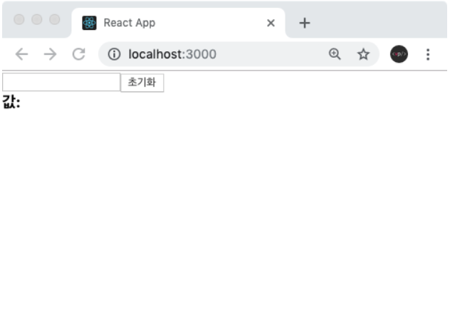
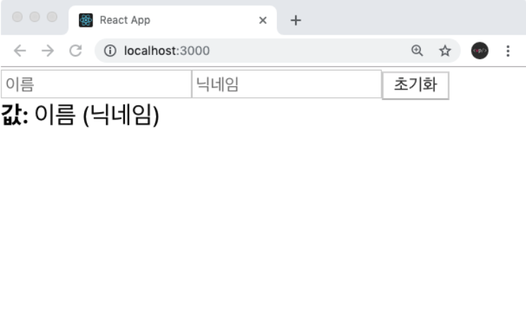

# 1. Form

React에서 Form 태그 안에 있는 input, textarea, select등의 요소를 제어하는 방법.

```jsx
<form>
    
  <label>
        Name:     
    <input type="text" name="name" />
      
  </label>
    
  <input type="submit" value="Submit" />
</form>
```

## **Controlled Component**

Controlled Component는 State에 따라서 값을 갱신하는 컴퍼넌트다.

HTML에서 `<input>`, `<textarea>`, `<select>`와 같은 폼 엘리먼트는 일반적으로 사용자의 입력을 기반으로 자신의 state를 관리하고 업데이트한다. React에서는 변경할 수 있는 state가 일반적으로 컴포넌트의 state 속성에 유지되며 `[setState()]`에 의해 업데이트된다.

예를 들어, 이전 예시가 전송될 때 이름을 기록하길 원한다면 폼을 제어 컴포넌트 (controlled component)로 작성할 수 있다.

```jsx
class NameForm extends React.Component {
  constructor(props) {
    super(props);
    this.state = { value: "" };

    this.handleChange = this.handleChange.bind(this);
    this.handleSubmit = this.handleSubmit.bind(this);
  }

  handleChange(event) {
    this.setState({ value: event.target.value });
  }

  handleSubmit(event) {
    alert("A name was submitted: " + this.state.value);
    event.preventDefault();
  }

  render() {
    return (
      <form onSubmit={this.handleSubmit}>
        <label>
          Name:
          <input
            type="text"
            value={this.state.value}
            onChange={this.handleChange}
          />
        </label>
        <input type="submit" value="Submit" />
      </form>
    );
  }
}
```

`value` 어트리뷰트는 폼 엘리먼트에 설정되므로 표시되는 값은 항상 `this.state.value`가 된다. React state를 업데이트하기 위해 모든 키 입력에서 `handleChange`가 동작하기 때문에 사용자가 입력할 때 보여지는 값이 업데이트된다.

제어 컴포넌트로 사용하면, input의 값은 항상 React state에 의해 결정된다. 코드를 조금 더 작성해야 한다는 의미이지만, 다른 UI 엘리먼트에 input의 값을 전달하거나 다른 이벤트 핸들러에서 값을 재설정할 수 있다.

> ### 자세한 설명 : https://ko.reactjs.org/docs/forms.html

## 2. input 상태 관리하기

2-1. InputSample.js 파일 생성

```jsx
import React from "react";

function InputSample() {
  return (
    <div>
      <input />
      <button>초기화</button>
      <div>
        <b>값: </b>
      </div>
    </div>
  );
}

export default InputSample;
```

2-2. App.js에 렌더링

```jsx
import React from "react";
import InputSample from "./InputSample";

function App() {
  return <InputSample />;
}

export default App;
```



# 3. useState 사용하여 input 입력값을 변동 시키기.

InputSample.js

```jsx
import React, { useState } from "react";

function InputSample() {
  const [text, setText] = useState("");

  const onChange = (e) => {
    setText(e.target.value);
  };

  const onReset = () => {
    setText("");
  };

  return (
    <div>
      <input onChange={onChange} value={text} />
      <button onClick={onReset}>초기화</button>
      <div>
        <b>값: {text}</b>
      </div>
    </div>
  );
}

export default InputSample;
```

**구현 :** input에 입력하는 값이 하단에 나타나게 하고, 초기화 버튼을 누르면 input 값이 비워지도록 할 것.

**설명 :** input 의 `onChange` 라는 이벤트를 사용하여 이벤트에 등록하는 함수에서는 이벤트 객체 `e` 를 파라미터로 받아와서 사용 할 수 있다.

이 객체의 `e.target` 은 이벤트가 발생한 DOM 인 input DOM 을 가르키게된다. 이 DOM 의 `value` 값, 즉 `e.target.value` 를 조회하면 현재 input 에 입력한 값이 무엇인지 알 수 있다.

이 값을 `useState` 를 통해서 관리를 해주면 된다.

input 의 상태를 관리할 때에는 input 태그의 value 값도 설정해주는 것이 중요하다. 그렇게 해야, 상태가 바뀌었을때 input 의 내용도 업데이트 된다.

# 4. 여러개의 input 상태 관리하기

4-1. InputSample.js

```jsx
import React, { useState } from "react";

function InputSample() {
  const onChange = (e) => {};

  const onReset = () => {};

  return (
    <div>
      <input placeholder="이름" />
      <input placeholder="닉네임" />
      <button onClick={onReset}>초기화</button>
      <div>
        <b>값: </b>
        이름 (닉네임)
      </div>
    </div>
  );
}

export default InputSample;
```



> ### **Q. input 개수가 여러개가 됐을 때 어떻게 관리해야 할까?**

단순히 useState 를 여러번 사용하고 onChange 도 여러개 만들어서 구현 할 수 있지만 그 방법은 가장 좋은 방법은 아니다. 더 좋은 방법은, input 에 name 을 설정하고 이벤트가 발생했을 때 이 값을 참조하는 것이다. 그리고, useState 에서는 문자열이 아니라 객체 형태의 상태를 관리해주어야 한다.

**InputSample.js**

```jsx
import React, { useState } from "react";

function InputSample() {
  const [inputs, setInputs] = useState({
    name: "",
    nickname: "",
  });

  const { name, nickname } = inputs; // 비구조화 할당을 통해 값 추출

  const onChange = (e) => {
    const { value, name } = e.target; // 우선 e.target 에서 name 과 value 를 추출
    setInputs({
      ...inputs, // 기존의 input 객체를 복사한 뒤
      [name]: value, // name 키를 가진 값을 value 로 설정
    });
  };

  const onReset = () => {
    setInputs({
      name: "",
      nickname: "",
    });
  };

  return (
    <div>
      <input name="name" placeholder="이름" onChange={onChange} value={name} />
      <input
        name="nickname"
        placeholder="닉네임"
        onChange={onChange}
        value={nickname}
      />
      <button onClick={onReset}>초기화</button>
      <div>
        <b>값: </b>
        {name} ({nickname})
      </div>
    </div>
  );
}

export default InputSample;
```

> ### **Q. 리액트 상태에서 객체를 수정해야 할 때는 어떻게 해야할까?**

**리액트에서는 "불변성"을 지켜줘야 한다.** 불변성을 지켜주어야만 리액트 컴포넌트에서 상태가 업데이트가 됐음을 감지 할 수 있고 이에 따라 필요한 리렌더링이 진행된다.

**리액트에서 객체를 업데이트하게 될 때에는 기존 객체를 직접 수정하면 안되고, 새로운 객체를 만들어서, 새 객체에 변화를 주어야 된다.**

예시 1) 잘못 된 예시

```jsx
inputs[name] = value; // 기존 상태에서 직접 수정 안됨.
```

예시 2) 옳은 예시

```jsx
setInputs({
  ...inputs,
  [name]: value, // 새로운 객체를 만들어서 수정해야함.
});
```
