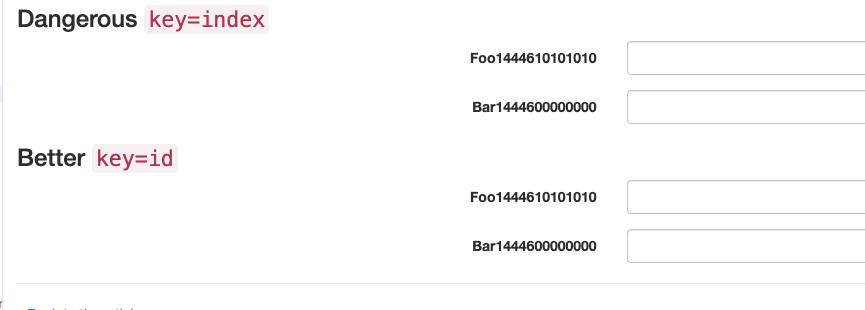
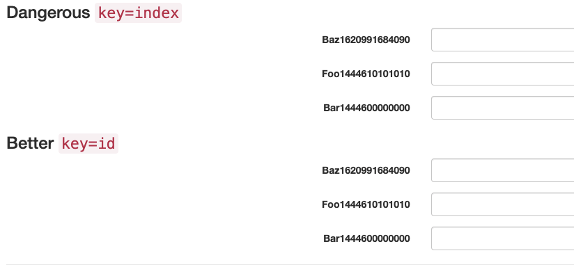
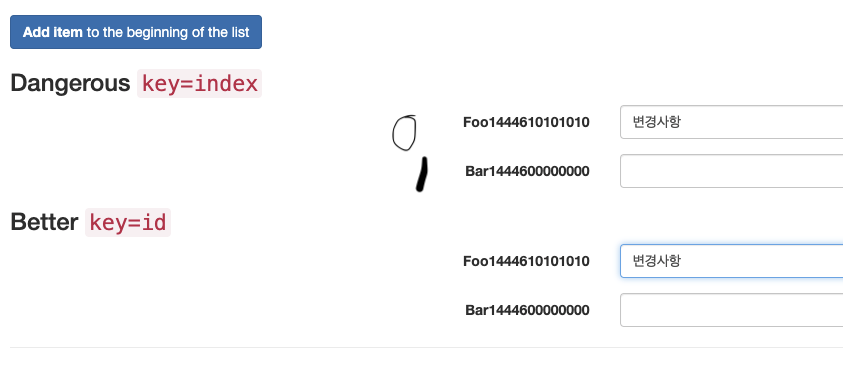
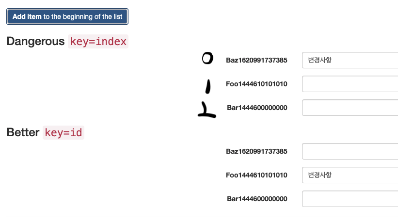

# List and Key


## React의 List 렌더링은 어떻게 이루어질까?  (map 메서드)

React에서의 List의 렌더링은 Javascript의 map 메서드를 이용하여 이루어집니다.

map 함수는 배열의 각 요소를 하나씩 일대일 연산을 통해 새로운 배열로 리턴하게 되는 함수인데요.

이를 이용해서 **React는 배열값을 순회하며 React Element 리스트로 리턴하게 됩니다.** 

리스트를  view 로 렌더링 한다는 것은 결국 반복되는 데이터를 프로그래밍적으로 하나씩 가져와 데이터 만큼의 UI를 생성(리턴)하기에 리액트에서 map 함수를 쓰는 것이 의미가 잘 맞는다고 할 수 있겠습니다.

[Array.prototype.map() - JavaScript | MDN](https://developer.mozilla.org/ko/docs/Web/JavaScript/Reference/Global_Objects/Array/map)

## 여러 개의 컴포넌트 렌더링 하기

예시로 리액트 공식문서의 numbers 란 배열을 하나씩 <li> 내부로 가져와 배열 내부의 값의 개수만큼 리턴해주는 코드를 가져왔습니다. 

```jsx
function NumberList(props) { 
	//========= 현재 여기의 props : {numbers : [1, 2, 3, 4, 5]} 
  const numbers = props.numbers;
	//========= 하나씩 배열의 값들을 매핑하여 li로 리턴
  const listItems = numbers.map((number) =>
    <li>{number}</li>
  );
  return (
    <ul>{listItems}</ul> // <li>1</li> <li>2</li>....가 들어감
  );
}

const numbers = [1, 2, 3, 4, 5];
ReactDOM.render(
  <NumberList numbers={numbers} />,
  document.getElementById('root')
);
```

위의 코드는 이렇게 렌더링 됩니다. 

```jsx
//================== 기대되는 결과값 ==================//
<div id="root">
	<ul>
		<li>1</li>
		<li>2</li>
		<li>3</li>
		<li>4</li>
		<li>5</li>
	</ul>
</div>
```

위의 코드에서는 언뜻 봐서는 별 문제가 없어보이지만,

"Each child in a list should have a unique 'key' prop" 라는 에러를 터트릴 것입니다.

여기서 주목해야할 점이 있는데요. React에서는 list를 렌더링할 때 중요한 개념이 있습니다. 바로 key값을 할당해줘야 한다는 점인데요. **데이터의 유니크한 값으로 할당하는 것이 규칙입니다.** 

```jsx
function NumberList(props) {
  const numbers = props.numbers;
  const listItems = numbers.map((number) =>
    <li key={number.toString()}>//key 할당
      {number}
    </li>
  );
  return (
    <ul>{listItems}</ul>
  );
}

const numbers = [1, 2, 3, 4, 5];
ReactDOM.render(
  <NumberList numbers={numbers} />,
  document.getElementById('root')
);
```

이렇듯 배열을 렌더링할 때에는 key 값을 잘 할당하는 것이 중요한데요. 그 이유를 아래에서 알아보도록 합시다.

## List 렌더링 에서의 Key역할

Key는 React가 어떤 항목을 **변경, 추가 또는 삭제할지 식별하는 것**을 도와줍니다.

ReactElement에 직접 지정해주면 됩니다. 아래의 예시와 같이요. 

```jsx
const numbers = [1, 2, 3, 4, 5];
const listItems = numbers.map((number) =>
  <li key={number.toString()}>
    {number}
  </li>
);
```

List의 값이 변경되고, rerendering이 될 때, React는 기존의 Key값에 맞춰 변화된 List 데이터들에 대해 확인하게 되고, 그에 따라 엘리먼트들을 리턴해주게 됩니다. 

만약에 key값으로 a,b,c,d가 있던 리스트에서 a,b,e,c,d 로 변경이 되었다면, 기존에 저장되어 있던 값에서 a,b,c,d와 일치하던 부분은 이에 맞춰 동일한 DOM Element를 보여주게 됩니다.
(기존 돔트리와 이후 트리의 자식들이 일치하는 지  확인합니다. Key가 동일 할 경우, 동일한 DOM Element를 보여줍니다. )

그리고 변화된 부분에 있어서 새로운 렌더를 해주게 되는 것이죠.

리액트에서는 Key를 선택하는 가장 좋은 방법은 리스트의 다른 항목들 사이에서 해당 항목을 **고유하게 식별할 수 있는 문자열을 사용**하는 것이라고 합니다. 

**그리고 대부분의 경우 데이터의 Id 를 Key로 사용하게 된다고 합니다.** 

그리고 안정적인 Id가 없다면 최후의 수단으로 항목의 인덱스를 key로 사용할 수 있다고 합니다. 

하지만 앞서 이야기했듯이 key가 리렌더링의 알고리즘에서 요소의 구분 수단으로 이용하기 때문에 인덱스를 key로 사용시 항목의 순서가 바뀌었을 때 key 또한 바뀔 것입니다. 

## 인덱스를 Key값으로 쓰지 말아야 될 이유

key를 인덱스로 썼을 때 왜 안좋은 지에 대해서 설명하는 이 글을 읽고 정리해보도록 하겠습니다.

[Index as a key is an anti-pattern](https://robinpokorny.medium.com/index-as-a-key-is-an-anti-pattern-e0349aece318)

1. 기존 배열의 앞에 값을 추가하는 로직을 실행합니다.   
이 경우에는 DOM에 변경사항이 없어 인덱스값은 인덱스값대로 키에 들어가고 또 그 앞에 새로운 요소가 추가되는 로직이 잘 작동하게 됩니다.    

  
  

2. 하지만 인풋에 값을 작성하고 (DOM에 변화를 일으키고) 배열의 앞에 새로운 값을 추가하게 된다면

    
  

기대했던 아래의 결과값과는 달리 배열의 0 번째에 계속 저 DOM의 값이 기록되게 됩니다.   
이유를 알기위해선 일단 저 버튼을 누르기 전 상태로 돌아갑니다.    
저 버튼을 누르기 전에 key가 0인 곳에 저 변경사항을 작성한 변경사항이 등록되게 되는데요.    
추가 버튼을 누르면 list 데이터가 변경이 되면서 rerender되면서  index 가 다시 매핑됩니다.     
그리고 맨 앞에 추가된 Baz162...에 0 이 매핑되고, 그 키값에 맞추어 DOM 의 값을 맞춰주기 때문에 저런 결과가 발생하게 됩니다.    
그리고 이는 삭제등의 과정을 거칠 때에도 같은 배열을 동적으로 조작할시  비슷한 과정을 겪게되는데요, 이런 부분 때문에 주의해서 Key값을 등록해야할 것입니다.   

## Key는 형제 사이에서만 고유한 값이어야 한다.

Key는 배열 안에서 형제 사이에서 고유해야 하고 전체 범위에서 고유할 필요는 없습니다. 두 개의 다른 배열을 만들 때 동일한 Key를 사용할 수 있습니다. 

```jsx
function Blog(props) {
  const sidebar = (
    <ul>
      {props.posts.map((post) =>
        <li key={post.id}>
          {post.title}
        </li>
      )}
    </ul>
  );
  const content = props.posts.map((post) =>
    <div key={post.id}>
      <h3>{post.title}</h3>
      <p>{post.content}</p>
    </div>
  );
  return (
    <div>
      {sidebar}
      <hr />
      {content}
    </div>
  );
}

const posts = [
  {id: 1, title: 'Hello World', content: 'Welcome to learning React!'},
  {id: 2, title: 'Installation', content: 'You can install React from npm.'}
];
ReactDOM.render(
  <Blog posts={posts} />,
  document.getElementById('root')
);
```

component에 key를 할당시 props로 전달되지는 않습니다.    
(props.key 존재 x)    
만약 할당한 값이 필요시에 명시적으로 따로 전달합니다.    

```jsx
const content = posts.map((post) =>
  <Post
    key={post.id}
    id={post.id}
    title={post.title} />
);
```

## JSX에 map() 포함시키기

반복적으로 만든 컴포넌트를 변수에 담에 JSX에 포함시킬 수 있습니다.    
하단처럼 반복적으로 만든 컴포넌트를 변수에 담아 리턴시키고 있습니다.    

```jsx
function NumberList(props) {
  const numbers = props.numbers;
//============ 반복적으로 생성한 컴포넌트
  const listItems = numbers.map((number) =>
    <ListItem key={number.toString()}
              value={number} />
  );
  return (
    <ul>
      {listItems}
    </ul>
  );
```

이걸 변수에 담지 않고 중괄호 안에 javascript 표현식을 바로 쓸 수 있으므로 바로 담아 처리하면 코드가 깔끔해집니다. 

```jsx
function NumberList(props) {
  const numbers = props.numbers;
  return (
    <ul>
      {numbers.map((number) =>
        <ListItem key={number.toString()}
                  value={number} />
      )}
    </ul>
  );
}
```

하지만 이것도 map이 너무 중첩된다면 가독성이 좋지 않으므로 컴포넌트로 따로 추출하는 것도 좋은 방법이라고 설명하고 있습니다.