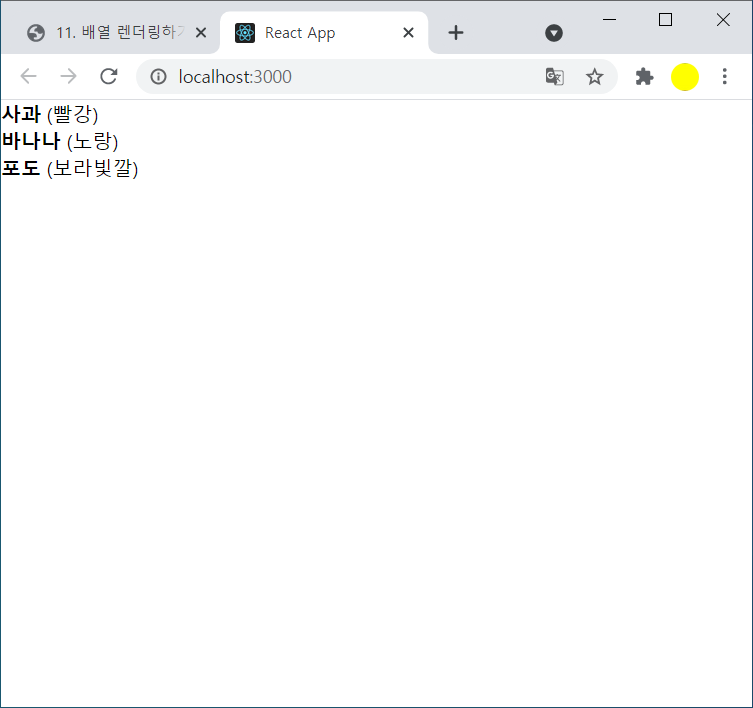
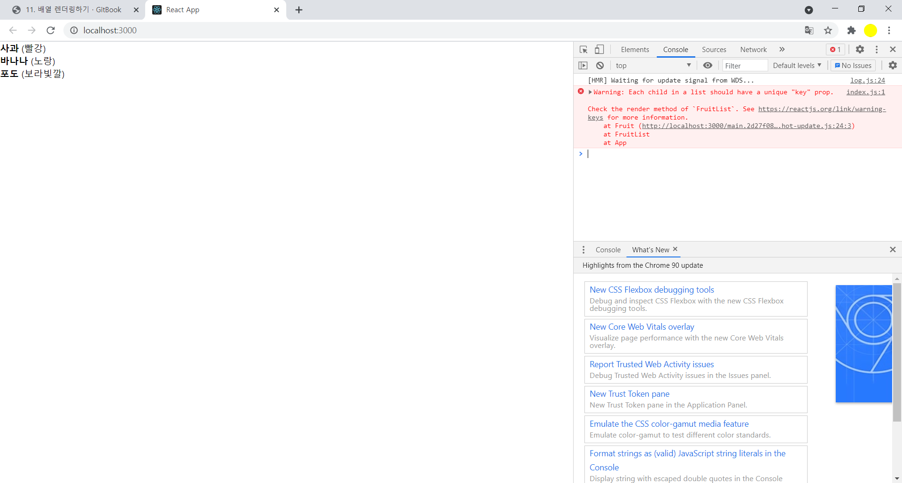
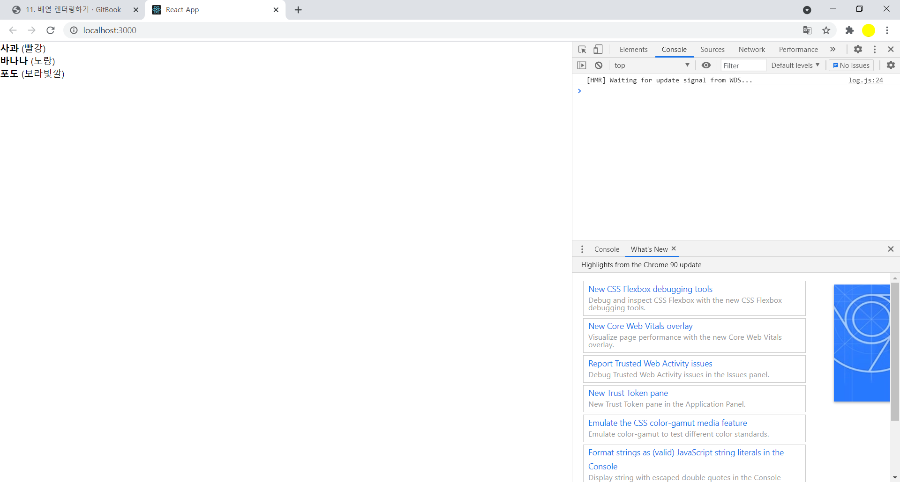

# 배열 렌더링

- 과일 종류와 과일색상을 배열로 표기

### FruitList.js

```
import React from 'react';

function FruitList(){
    const fruits = [
        {
            id: 1,
            fruitName: '사과',
            fruitColor: '빨강'
        },
        {
            id: 2,
            fruitName: '바나나',
            fruitColor: '노랑'
        },
        {
            id: 3,
            fruitName: '포도',
            fruitColor: '보라빛깔'
        }

    ];

    return (
        <div>
          <div>
            <b>{fruits[0].fruitName}</b> <span> ({fruits[0].fruitColor})</span>
          </div>
          <div>
            <b>{fruits[1].fruitName}</b> <span> ({fruits[1].fruitColor})</span>
          </div>
          <div>
            <b>{fruits[2].fruitName}</b> <span> ({fruits[2].fruitColor})</span>
          </div>
        </div>
      );
}

export default FruitList;
```

 





- 과일의 이름과 색상을 출력해주는 Fruit 컴포넌트로 재구성 

###  FruitList.js

```
import React from 'react';

function Fruit({ fruit }){
    return(
      <div>
        <b>{fruit.fruitName}</b> <span>({fruit.fruitColor})</span>
      </div>       
    );
}

function FruitList(){
    const fruits = [
        {
            id: 1,
            fruitName: '사과',
            fruitColor: '빨강'
        },
        {
            id: 2,
            fruitName: '바나나',
            fruitColor: '노랑'
        },
        {
            id: 3,
            fruitName: '포도',
            fruitColor: '보라빛깔'
        }

    ];

    return (
        <div>
            <Fruit fruit={fruits[0]} />
            <Fruit fruit={fruits[1]} />
            <Fruit fruit={fruits[2]} />
        </div>
      );
}

export default FruitList;
```


- 동적인 배열을 렌더링 할때는 배열의 내장함수 map()을 사용

- map()함수는 배열의 각원소를 변환하여 새로운 배열을 생성

- 리액트에서 동적인 배열을 랜더링해야 할때는 이 함수를 사용하여 일반 데이터배열을 리엑트 엘리먼트로 이루어진 배열로 변환해주면 된다

  

###  FruitList.js

```
import React from 'react';

function Fruit({ fruit }){
    return(
      <div>
        <b>{fruit.fruitName}</b> <span>({fruit.fruitColor})</span>
      </div>       
    );
}

function FruitList(){
    const fruits = [
        {
            id: 1,
            fruitName: '사과',
            fruitColor: '빨강'
        },
        {
            id: 2,
            fruitName: '바나나',
            fruitColor: '노랑'
        },
        {
            id: 3,
            fruitName: '포도',
            fruitColor: '보라빛깔'
        }

    ];

    return (
      <div>
            {fruits.map(fruit => (
            	<Fruit fruit={fruit} />
            ))}
       </div>      
       );
}

export default FruitList;
```


- 화면에는 정상적으로 나오지만 console창에 각 자식은 고유한 "key" prop을 반드시 가져야 한다는 경고발생



 


- 배열 렌더링시 key라는 props를 설정해야 한다
- key 값은 각 원소들마다 가지고 있는 고유값으로 설정(현재는 id값)


###  FruitList.js

```
return (
        <div>
            {fruits.map(fruit => (
            	<Fruit fruit={fruit} key={fruit.id} />
            ))}
        </div>      
      );
```


- 콘솔 경과 사라짐

  

  

- 만약 배열안 원소가 자체로 가지고 있는 고유한 값이 없다면 map 함수를 사용할 때 설정하는 콜백함수의 두번째 파라미터 index를 key로 사용

### FruitList.js

```
  return (
        <div>
            {fruits.map((fruit, index) => (
            	<Fruit fruit={fruit} key={index} />
            ))}
        </div>      
      );
```

 

- 배열 아이템의 삽입 또는 수정시 효율적인 렌더링을 위해 렌더링시 고유한 key값이 있는 것이 중요


