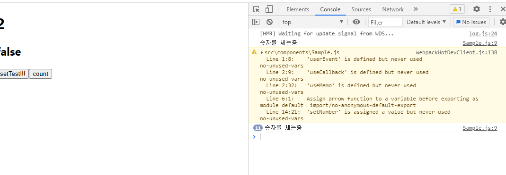
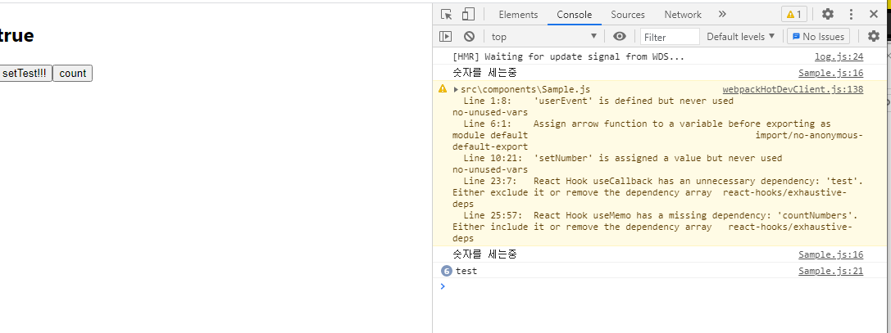
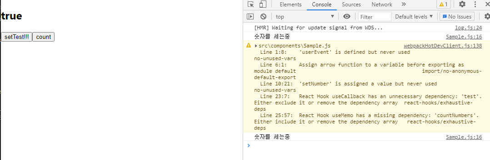

# useCallback

## useCallback 이란?

useCallback이란 리렌더링이 될 시에 콜백함수도 불필요하게 다시 만들어지는 상황을 방지하여 성능 최적화를 하기 위해서 생긴 hook입니다.    
useMemo 와 같이 이전에 만들어진 값을 재사용하기 위해 메모이제이션을 하여 이전에 만들어 놓은 콜백함수를 그대로 재사용합니다. (정확히는 값이 아닌 함수를 재사용한다.)   

useCallback을  사용하게 될 경우에 함수 재생성을 방지할 수는 있지만 이용하고 있는 state값이나 props값이 있을 경우 그 값이 변경되었을 시에 함수를 재생성하기 위해 의존성 배열 (deps) 내부에 값을 넣어 줘야 합니다.    

useCallback의 기본적인 형태는 이렇습니다.    

```javascript
const memoizedCallback = useCallback(
  () => {
    doSomething(a, b); // 실행내역
  },
  [a, b], // 참고하고 있는 의존성 배열
);
```

useCallback 을 import 하여 훅 첫 번쨰 인자로 콜백함수를 넣고, 두 번째 인자로 의존성 배열을 넣어줍니다.   

## useCallback을 쓰지 않을 경우 
숫자를 세는 함수인 countNumbers 와 test란 state의 값을 토글시키는 함수 두 가지가 있는 컴포넌트를 샘플로 만들어 보았습니다.  

```javascript
export default () => {

    const [numbers, setNumber] = useState([1,2])
    const [test, setTest] = useState(true)

    const countNumbers = (numbers) => {
        console.log('숫자를 세는중')
        return numbers.length
    }
    const onClickTest = () => {
        setTest((prev) =>!prev)
    }
    const count = countNumbers(numbers)
    return(
        <>
        <div>
            <h1>{count}</h1>
            <h2>{test.toString()}</h2>
            <button onClick={onClickTest}>setTest!!!</button>
            <button onClick={countNumbers}>count</button>
        </div>
        </>
    )
}
```

test를 토글 시키는 함수를 호출하게 될 경우에    
  


이렇게 countNumbers는 재생성이 될 필요가 없는데도 불구하고 계속해서 불필요한 함수 재생성을 하게 됩니다.   

이 코드를 useMemo 와 useCallback을 이용해 함수 리렌더링을 방지하게 되는 코드로 바꾸어보면   

```javascript
export default () => {
    const [numbers, setNumber] = useState([1,2])
    const [test, setTest] = useState(true)

    const countNumbers = useCallback(() => {
        console.log('숫자를 세는중')
        return numbers.length
    },[numbers])

    const onClickTest = useCallback(() => {
        console.log("test")
        setTest((prev) =>!prev)
    },[test])

    const count = useMemo(() => countNumbers(numbers),[numbers])
    return(
        <>
        <div>
            <h1>{count}</h1>
            <h2>{test.toString()}</h2>
            <button onClick={onClickTest}>setTest!!!</button>
            <button onClick={countNumbers}>count</button>
        </div>
        </>
    )
}
```

onClickTest를 클릭했을 때 이전에 불필요하게 countNumbers 함수가 재생성이 되었던 부분이 개선되었습니다.     
 

또한 이렇게 countNumbers만 클릭했을 때는 불필요하게 test함수가 리렌더링 되는 상황도 쉽게 개선할 수 있었습니다.    
  

 또한 의존성 배열에 state나 props 값이 제대로 들어가 있지 않다면 
 "React Hook useCallback has a missing dependency: 'numbers.length'. Either include it or remove the dependency array  react-hooks/exhaustive-deps"란 경고를 터트리기 때문에 이런 점을 쉽게 개선해서 개발에 적용시킬 수 있습니다.    