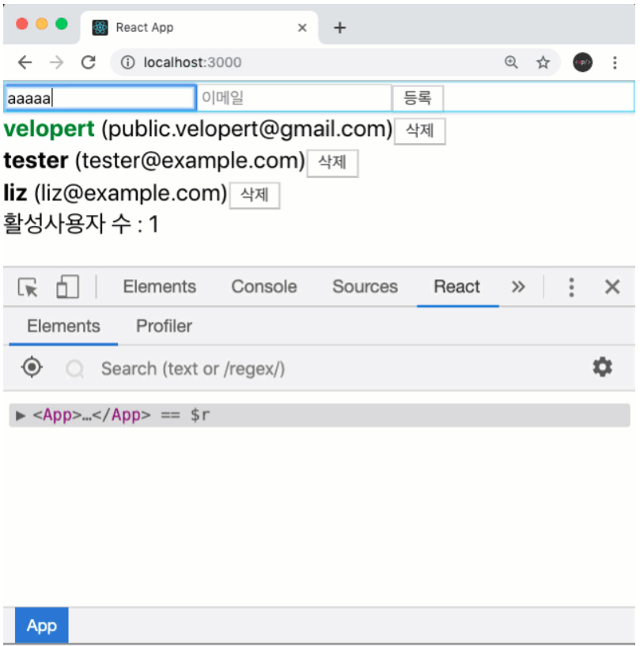
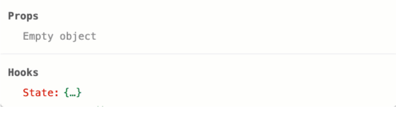
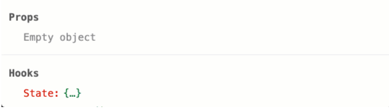

# 14. React.memo

## 1. **React.memo()란?**

> UI 성능을 증가시키기 위해, React는 고차 컴퍼넌트(Higher Order Component, HOC) `React.memo()`를 제공한다. 렌더링 결과를 메모이징(Memoizing)함으로써, 불필요한 리렌더링을 건너뛴다.
> React는 먼저 컴퍼넌트를 렌더링(rendering) 한 뒤, 이전 렌더된 결과와 비교하여 DOM 업데이트를 결정한다. 만약 렌더 결과가 이전과 다르다면, React는 DOM을 업데이트한다.
> 다음 렌더링 결과와 이전 결과의 비교는 빠르다. 하지만 어떤 상황에서는 이 과정의 속도를 좀 더 높일 수 있다.
> 컴퍼넌트가 `React.memo()`로 래핑 될 때, React는 컴퍼넌트를 렌더링하고 결과를 메모이징(Memoizing)한다. 그리고 다음 렌더링이 일어날 때 `props`가 같다면, React는 메모이징(Memoizing)된 내용을 재사용한다.

**CreateUser.js**

```jsx
import React from "react";

const CreateUser = ({ username, email, onChange, onCreate }) => {
  return (
    <div>
      <input
        name="username"
        placeholder="계정명"
        onChange={onChange}
        value={username}
      />
      <input
        name="email"
        placeholder="이메일"
        onChange={onChange}
        value={email}
      />
      <button onClick={onCreate}>등록</button>
    </div>
  );
};

export default React.memo(CreateUser);
```

**UserList.js**

```jsx
import React from "react";

const User = React.memo(function User({ user, onRemove, onToggle }) {
  return (
    <div>
      <b
        style={{
          cursor: "pointer",
          color: user.active ? "green" : "black",
        }}
        onClick={() => onToggle(user.id)}
      >
        {user.username}
      </b>
      &nbsp;
      <span>({user.email})</span>
      <button onClick={() => onRemove(user.id)}>삭제</button>
    </div>
  );
});

function UserList({ users, onRemove, onToggle }) {
  return (
    <div>
      {users.map((user) => (
        <User
          user={user}
          key={user.id}
          onRemove={onRemove}
          onToggle={onToggle}
        />
      ))}
    </div>
  );
}

export default React.memo(UserList);
```

적용을 다 하고 나서, input 을 수정 할 때 하단의 UserList 가 리렌더링이 되지 않는것을 확인.





그런데, User 중 하나라도 수정하면 모든 User 들이 리렌더링되고, CreateUser 도 리렌더링이 된다.




이유는 users 배열이 바뀔때마다 onCreate 도 새로 만들어지고, onToggle,onRemove 도 새로 만들어지기 때문이다.

## 2. 언제 React.memo()를 써야할까?

> `React.memo()`는 함수형 컴퍼넌트에 적용되어 같은 props에 같은 렌더링 결과를 제공한다.
> `React.memo()`를 사용하기 가장 좋은 케이스는 함수형 컴퍼넌트가 같은 `props`로 자주 렌더링 될거라 예상될 때이다.
> **컴퍼넌트가 같은 props로 자주 렌더링되거나, 무겁고 비용이 큰 연산이 있는 경우, React.memo()로 컴퍼넌트를 래핑할 필요가 있다.**

위의 예시를 보면,

1. User 컴포넌트에 `b` 와 `button` 에 `onClick` 으로 설정해준 함수들은, 해당 함수들을 `useCallback` 으로 재사용한다고 해서 리렌더링을 막을 수 있는것은 아니므로, 굳이 그렇게 할 필요 없다.
2. 렌더링 최적화 하지 않을 컴포넌트에 React.memo 를 사용하는것은, 불필요한 props 비교만 하는 것이기 때문에 실제로 렌더링을 방지할수있는 상황이 있는 경우에만 사용해야한다.
3. React.memo 에서 두번째 파라미터에 `propsAreEqual` 이라는 함수를 사용하여 특정 값들만 비교를 하는 것도 가능하다.

```jsx
export default React.memo(
  UserList,
  (prevProps, nextProps) => prevProps.users === nextProps.users
);
```

## 3. 언제 React.memo()를 사용하지 말아야 할까

> 기술적으로는 가능하지만 클래스 기반의 컴퍼넌트를 `React.memo()`로 래핑하는것은 적절하지 않다. 클래스 기반의 컴퍼넌트에서 메모이제이션이 필요하다면 `PureComponent`를 확장하여 사용하거나, `shouldComponentUpdate()` 메서드를 구현하는 것이 적절하다.

### **3.1 쓸모없는 props 비교**

> 렌더링될 때 `props`가 다른 경우가 대부분인 컴포넌트를 생각해보면, 메모이제이션 기법의 이점을 얻기 힘들다.
> `props`가 자주 변하는 컴퍼넌트를 `React.memo()`로 래핑할지라도, React는 두 가지 작업을 리렌더링 할 때마다 수행할 것이다.

1. 이전 `props`와 다음 `props`의 동등 비교를 위해 비교 함수를 수행한다.
2. 비교 함수는 거의 항상 `false`를 반환할 것이기 때문에, React는 이전 렌더링 내용과 다음 렌더링 내용을 비교할 것이다.
   비교 함수의 결과는 대부분 `false`를 반환하기에 `props` 비교는 불필요하게 된다.

## 4. **React.memo() 은 성능 개선의 도구다.**

> `React.memo()`는 함수형 컴퍼넌트에서도 메모이제이션의 장점을 얻게 해 주는 훌륭한 도구다.
> 대부분의 상황에서 React는 메모이징 된 컴퍼넌트의 리렌더링을 피할 수 있지만, 렌더링을 막기 위해 메모이제이션에 의존하면 안된다.
> 올바르게 적용 된다면 변경되지 않은 동일한 prop에 대해 리렌더링을 하는 것을 막을 수 있다.
> 다만, 콜백 함수를 prop으로 사용하는 컴퍼넌트에서 메모이징을 할 때 주의하라. 그리고 같은 렌더링을 할 때 이전과 동일한 콜백 함수 인스턴스를 넘기는지 확실히 하라.
> 그리고 메모이제이션의 성능상 이점을 측정하기 위해 [profiling]을 사용하는 것을 잊지 말자.

**참고문서 - [https://ui.toast.com/weekly-pick/ko_20190731](https://ui.toast.com/weekly-pick/ko_20190731)**
