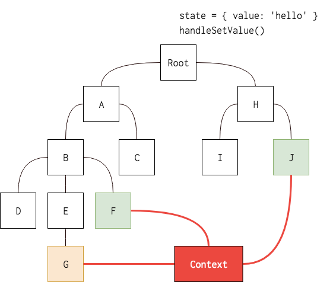
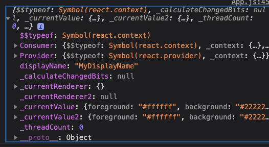

## ContextAPI 란?

React 애플리케이션에서 명시적인 부모-자식간의 Props 전달 과정 없이 어떤 트리의 컴포넌트 에서든 이 값을 공유해서 쓸 수 있도록 해주는 API

## 언제, 왜 쓰는 걸까

값을 Root ⇒ A ⇒ B ⇒ F 이렇게 내려주는 과정이 실제 프로젝트에서는 상당히 많이 필요한 과정. ( 전역적으로 다루는 css테마, 유저 정보, 언어정보 등...)  
실제 프로젝트에서는 컴포넌트의 깊이가 굉장히 깊을 수도 있고, 다루게 되는 데이터들도 훨씬 많아질 수도 있어  
유지보수성을 고려하여 **전역으로 사용할 수 있는 값들을 저장하기 위해 만들어진 API**입니다.

원래는 Redux, MobX와 같은 라이브러리를 사용하게 됬었는데 현재는 ContextAPI를 이용하여 글로벌 상태 관리를 쉽게 가능하게 합니다.



[Context - React](https://ko.reactjs.org/docs/context.html#when-to-use-context)

## API들

### React.createContext

**_Context 객체를 만듭니다._**

```jsx
const MyContext = React.createContext(defaultValue);

선언된 변수 -> 이 값으로 context객체에서 값을 찾을 수 있다.
defaultValue -> 트리안에서 적절한 Provider를 찾지 못했을 때 쓰이는 값.
```

Context.Provider로 컴포넌트를 감싸면 하위 트리들은 이 Context객체를 구독할 수 있습니다.

구독시에는 **Consumer객체나 useContext를 사용합니다**.

defaultValue는 트리안에서 적절한 Provider를 찾지 못했을 떄만 쓰이는 값입니다.  
Provider를 통해 undefined를 값으로 보낸다고 해도 구독 컴포넌트들이 defaultValue 를 읽지는 않는다는 점에 유의해야 합니다.

### Context.Provider

**_하위에 있는 컴포넌트에게 value를 전달할 수 있도록 감싸줍니다._**

```jsx
<MyContext.Provider value={/* 어떤 값 */}>
{/* 하위 컴포넌트들에게 value prop으로 값을 전달합니다.*/}
```

Context 오브젝트에 포함된 React 컴포넌트인 **Provider는 context를 구독하는 컴포넌트들에게 context의 변화를 알리는 역할**을 합니다.

Provider 컴포넌트는 value prop을 받아서 전달합니다.  
또 Provider 하위에 다른 Provider를 배치하는 것도 가능하며, 하위 Provider들의 값이 우선시됩니다.  
Provider하위에서 context를 구독하는 모든 컴포넌트는 value prop이 바뀔 때마다 다시 렌더링 됩니다.  
Provider로 부터 하위 consumer (context의 변화를 구독하는 컴포넌트) 로의 전파시 shouldComponentUpdate가 무시되어 shouldComponentUpdate 생명주기에서 false를 선언하더라도, 하위 컴포넌트는 무조건 업데이트가 되도록 구현이 되어있습니다. **때문에 무조건 consumer가 업데이트 됩니다.**

### Class.contextType

**React.createContext()로 생성한 Context 객체를 원하는 클래스의 contextType 프로퍼티로 지정**할 수 있습니다.  
class 컴포넌트 안에서 this.context를 이용해 해당 context의 Provider를 찾아 그 값을 읽을 수 있게 됩니다.  
_다만, 이 API를 사용시에는 하나의 context만 구독할 수 있습니다._  
여러 context를 구독하려면 다음과 같은 식으로 구현하게 됩니다.

```javascript
// 기본값이 light인  ThemeContext
const ThemeContext = React.createContext("light");

// 로그인한 유저 정보를 담는 UserContext
const UserContext = React.createContext({
  name: "Guest",
});

class App extends React.Component {
  render() {
    const { signedInUser, theme } = this.props;

    // context 초기값을 제공하는 App 컴포넌트
    return (
      <ThemeContext.Provider value={theme}>
        <UserContext.Provider value={signedInUser}>
          <Layout />
        </UserContext.Provider>
      </ThemeContext.Provider>
    );
  }
}

// ========== App 의 다음 단계의 컴포넌트
function Layout() {
  return (
    <div>
      <Sidebar />
      <Content />
    </div>
  );
}

// ========== Layout의 다음 번째의 최하위 컴포넌트
// 여러 context의 값을 받는 컴포넌트
// Consumer객체를 여러 개를 만들어 여러 context를 구독할 수 있도록 합니다.
function Content() {
  return (
    <ThemeContext.Consumer>
      {(theme) => (
        <UserContext.Consumer>
          {(user) => <ProfilePage user={user} theme={theme} />}
        </UserContext.Consumer>
      )}
    </ThemeContext.Consumer>
  );
}

//======== useContext를 사용하여 두 개의 Context 객체 구독 구현하기
function Content() {
  const user = useContext(UserContext);
  const theme = useContext(ThemeContext);
  return (
    <>
      <ProfilePage user={user} theme={theme} />
    </>
  );
}
```

### Context.Consumer

context의 변화를 구독하는 React 컴포넌트.   
현재 useContext를 이용해 좀 더 간단하고 명료하게 표현할 수 있다고 합니다. [참고링크](https://stackoverflow.com/questions/56816374/context-consumer-vs-usecontext-to-access-values-passed-by-context-provider)     

```jsx
<MyContext.Consumer>
  {value => /* context 값을 이용한 렌더링
	이 파라미터가 context의 현재 값을 의미
	리턴값이 React노드
	해당 context의 provider 중 상위 트리에서 가장 가까운 provider의 value prop
*/}
</MyContext.Consumer>

```

Context.Consumer의 내부에 들어오는 값들은 함수로 들어와야 한다고 합니다.    
parameter로는 context의 현재 값을 받으며 이 함수의 리턴값은 React node입니다. ( context객체를 받음.)      

### Context.displayName

Context객체는 displayName 을 지정할 수 있습니다.    
이렇게 지정하면 devTools에서 확인이 가능합니다.      
Context 객체에 저장이 됩니다.   


## 👉 예시들

### 변경가능한 값(State)을 구독하기

변경이 될 수 있는 값을 구독시키려면 Provider 의 value속성에 state값을 넣습니다.      
(현재 예시에서는 setState 함수를 props drilling을 통하여 전달하였습니다. / App → Toolbar → ThemedButtton)     
Provider내부에 있는 button은 theme이 변경될 때 함께 변경되지만 바깥에 있는 button은 변하지 않습니다.     

```javascript
import { ThemeContext, themes } from "./theme-context";
import ThemedButton from "./themed-button";

// ThemedButton를 사용하는 중간에 있는 컴포넌트
function Toolbar(props) {
  return <ThemedButton onClick={props.changeTheme}>Change Theme</ThemedButton>;
}

class App extends React.Component {
  constructor(props) {
    super(props);
    this.state = {
      theme: themes.light,
    };

    this.toggleTheme = () => {
      this.setState((state) => ({
        theme: state.theme === themes.dark ? themes.light : themes.dark,
      }));
    };
  }

  render() {
    return (
      <Page>
        {" "}
        {/* ThemeProvider 안에 있는 ThemedButton은 state로부터 theme 값을 읽지만 */}
        <ThemeContext.Provider value={this.state.theme}>
          <Toolbar changeTheme={this.toggleTheme} />
        </ThemeContext.Provider>
        <Section>
          {" "}
          {/* Provider 밖에 있는 ThemedButton는 기본값인 dark를 사용합니다.*/}
          <ThemedButton />
        </Section>
      </Page>
    );
  }
}

ReactDOM.render(<App />, document.root);
```

### 하위 컴포넌트에서 context 업데이트하기

위에 있는 예시에서는 state 를 변경하는 함수를 하위 컴포넌트에서 내려주기 위해 트리를 모두 거쳐 내려줬었는데

**context 를 통해 setState 값도 함께 내보내면 편리하게 값 변경 함수도 호출할 수 있습니다.**

- theme-context.js

```javascript
export const ThemeContext = React.createContext({
  theme: themes.dark,
  toggleTheme: () => {},
});
```

```javascript
import { ThemeContext, themes } from "./theme-context";
import ThemeTogglerButton from "./theme-toggler-button";

class App extends React.Component {
  constructor(props) {
    super(props);

    this.toggleTheme = () => {
      this.setState((state) => ({
        theme: state.theme === themes.dark ? themes.light : themes.dark,
      }));
    };

    // state에 업데이트 메서드도 포함되어있으므로
    // 이 또한 context Provider를 통해 전달될 것입니다.
    this.state = {
      theme: themes.light,
      toggleTheme: this.toggleTheme,
    };
  }

  render() {
    return (
      <ThemeContext.Provider value={this.state}>
        {" "}
        // Provider에 state 전체를 넘겨줍니다.
        <Content />
      </ThemeContext.Provider>
    );
  }
}

function Content() {
  return (
    <div>
      <ThemeTogglerButton />
    </div>
  );
}
```
