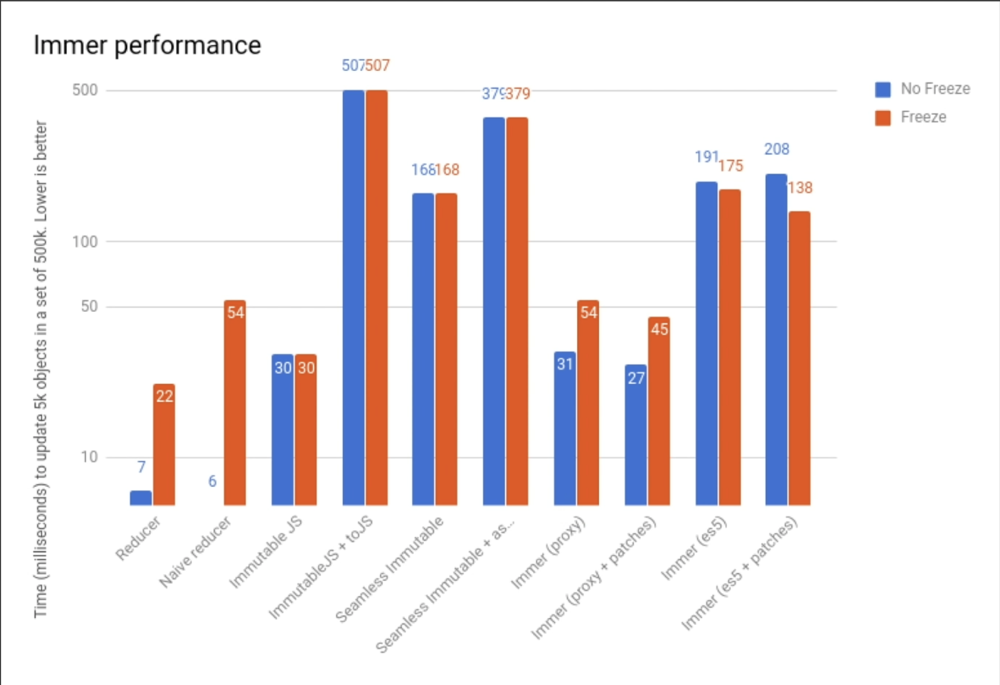

# Immer는 왜 쓰는 것일까?

> 리액트에서는 배열, 객체를 업데이트 할 때 직접 수정 하면 안되고
> 불변성을 지켜주면서 업데이트를 해주어야 합니다.

이것 때문에 우리는 이전에 불변성을 지키면서 새로운 객체를 만들기 위해서

`...`(스프레드 연산자), `concat`, `map`, `filter`을 사용해서 업데이트를 해왔습니다.

불변성 신경 하나도 안쓰고 마음대로 코딩할 수 있다면 참 편하겠습니다..
라고 생각할 때 쓰는게 바로 `Immer` 라이브러리 입니다! ㅋㅋ

간단한 형태의 데이터를 조작할 때는 충분히 위의 연산자들로 쉽게 조작이 가능하지만,
객체의 형태가 복잡하여 불변성을 신경쓰기 어려워지면 Immer를 사용해 봅시다.

> Q. Immer를 사용하면 속도가 느려지지 않을까?
> 
>
> Native reducer: 6ms
> Immer(proxy): 31ms
> Immer(es5 = 구형 브라우저): 191ms
>
> 5만개의 데이터 set 중 5천개를 업데이트 하는 것을 생각했을 때 속도 차이를 나타낸 그래프입니다.
> 확실히 native 기능을 사용하여 작성한 코드가 빠르지만 Immer 코드도 빠른 것을 볼 수 있습니다.
>
> (native로 작성할 수 있다면 좋지만 Immer 작성이 필요하다 느껴지면 쓰자!)

# Immer 사용

사용 전에 설치를 진행해주어야 합니다.

`yarn add immer` , `npm add immer` 써서 설치 해줍시다.

## 리듀서에서 `produce`의 사용

```jsx
import produce from 'immer'; // 그냥 immer로 사용해도 되지만 일반적으로 produce를 쓴다고 함

// 원형

produce(state, (draft) => {
  // 업데이트 코드 작성...
});
```

이렇게 immer를 불러온 뒤,
첫 번 째 파라미터에는 수정할 상태, 두 번 째 파라미터에는 어떻게 업데이트 할 지 함수를 작성해주면 끝 입니다.

```jsx
const state = {
  number: 1,
  dontChangeMe: 2,
};

const nextState = produce(state, (draft) => {
  draft.number += 1;
});

console.log(nextState);
// { number: 2, dontChangeMe: 2 }
```

```jsx
function reducer(state, action) {
  switch (action.type) {
    case 'CREATE_USER':
      return {
        users: state.users.concat(action.user),
      };

    case 'TOGGLE_USER':
      return {
        users: state.users.map((user) => (user.id === action.id ? { ...user, active: !user.active } : user)),
      };
  }
}
```

```jsx
function reducer(state, action) {
  switch (action.type) {
    case 'CREATE_USER':
      return produce(state, (draft) => {
        draft.users.push(action.user);
      });

    case 'TOGGLE_USER':
      return produce(state, (draft) => {
        const user = draft.users.find((user) => user.id === action.id);
        user.active = !user.active;
      });
  }
}
```

## useState 함수형 업데이트에 Immer 사용하기

```jsx
const [todo, setTodo] = useState({
  text: 'Hello',
  done: false,
});

const onClick = useCallback(() => {
  setTodo((todo) => ({
    ...todo,
    done: !todo.done,
  }));
}, []);
```

useState 함수형 업데이트를 사용한 모습

이 경우에는 Immer를 사용하면 더욱 간단하게 코드의 변경이 가능합니다.

```jsx
const [todo, setTodo] = useState({
  text: 'Hello',
  done: false,
});

const onClick = useCallback(() => {
  setTodo(
    produce((draft) => {
      draft.done = !draft.done;
    })
  );
}, []);
```

위처럼 produce 함수의 첫 번 째 파라미터로 draft를 넣게 되면 업데이트 함수가 return되어 함수형 업데이트를 할 때 대신 사용할 수 있습니다.

## Performance tips

Immer 사용을 더 자세하게 알아보고 싶다면 공식문서에서 확인합시다~

[Introduction to Immer | Immer](https://immerjs.github.io/immer/)
