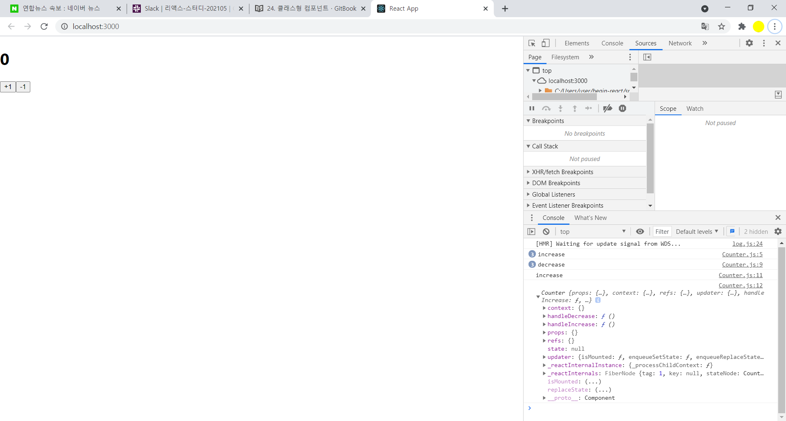

## Class type Component

- 클래스형 컴포넌트에서는 반드시 render() 메서드가 있어야 함
- 클래스 내부에 static 키워드와 함께 선언을 할수도 있음


### Hello.js

```react
import React, { Component } from 'react';

class Hello extends Component {
  static defaultProps = {
    name: '이름없음'
  };
  render() {
    const { color, name, isSpecial } = this.props;
    return (
      <div style={{ color }}>
        {isSpecial && <b>*</b>}
        안녕하세요 {name}
      </div>
    );
  }
}

export default Hello;
```


### Counter.js

```react
import React, { Component } from 'react';

class Counter extends Component {
  //constructor에서 바인딩
  constructor(props) {
    super(props);
    this.handleIncrease = this.handleIncrease.bind(this);
    this.handleDecrease = this.handleDecrease.bind(this);
  }
  handleIncrease() {
    console.log('increase');
    console.log(this);
  }

  handleDecrease() {
    console.log('decrease');
  }

  render() {
    return (
      <div>
        <h1>0</h1>
        <button onClick={this.handleIncrease}>+1</button>
        <button onClick={this.handleDecrease}>-1</button>
      </div>
    );
  }
}

export default Counter;
```





- 함수의 bind를 사용하면, 해당 함수에서 가르킬 this를 직접 설정해줄 수 있다.

- 생성자에서는 props 파라미터로 받아오고 super(props)를 호출해주여야 한다

- 클래스가 콤포넌트로서 작동할수 있도록 해주는 컴포넌트쪽에 구현되어 있는 생성자 함수를 먼저 실행해주고, 우리가 할 작업을 하겠다 라는것을 의미

- 이방법이 가장 일반적인 방법이고, 

- 또 하나의 방법은 커스텀 메서드를 선언할때 화살표 함수 문법을 사용해서 작성하는것

  


### Counter.js

```react
import React, { Component } from 'react';

class Counter extends Component {
  handleIncrease = () => {
    console.log('increase');
    console.log(this);
  };

  handleDecrease = () => {
    console.log('decrease');
  };

  render() {
    return (
      <div>
        <h1>0</h1>
        <button onClick={this.handleIncrease}>+1</button>
        <button onClick={this.handleDecrease}>-1</button>
      </div>
    );
  }
}

export default Counter;

```


- 마지막 방법은 onClick에서 새로운 함수를 만들어서 전달을 하는것
- 렌더링할때마다 함수가 새로 만들어지기 때문에 나중에 컴포넌트 죄적화시 작업이 까다로워진다


## 상태 선언하기

- 클래스형 컴포넌트에서 상태를 관리할때는 state를 사용하며, state를 선언할때에는 생성자내부에서 this.state를 설정해주면 된다

  

### Counter.js

```react
import React, { Component } from 'react';

class Counter extends Component {
  constructor(props) {
    super(props);
    this.state = {
      counter: 0
    };
  }
  
  handleIncrease = () => {
    console.log('increase');
    console.log(this);
  };

  handleDecrease = () => {
    console.log('decrease');
  };

  render() {
    return (
      <div>
        <h1>{this.state.counter}</h1>
        <button onClick={this.handleIncrease}>+1</button>
        <button onClick={this.handleDecrease}>-1</button>
      </div>
    );
  }
}

export default Counter;
```


- 클래스형 컴포넌트의 state는 객체형태여야 한다
- render method에서 state를 조회하려면 this.state를 조회


### Counter.js

```react
//CRA로 만든 프로젝트에서 사용(클래스에 특정 속성을 선언 할 수 있게 해주는 class-properties 라는 문법)
import React, { Component } from 'react';

class Counter extends Component {
  state = {
    counter: 0
  };
  handleIncrease = () => {
    console.log('increase');
    console.log(this);
  };

  handleDecrease = () => {
    console.log('decrease');
  };

  render() {
    return (
      <div>
        <h1>{this.state.counter}</h1>
        <button onClick={this.handleIncrease}>+1</button>
        <button onClick={this.handleDecrease}>-1</button>
      </div>
    );
  }
}

export default Counter;
```

- 숫자를 실제로  업데이트

### Counter.js

```react
import React, { Component } from 'react';

class Counter extends Component {
  state = {
    counter: 0,
    fixed: 1
  };
  handleIncrease = () => {
    this.setState({
      counter: this.state.counter + 1
    });
  };

  handleDecrease = () => {
    this.setState({
      counter: this.state.counter - 1
    });
  };

  render() {
    return (
      <div>
        <h1>{this.state.counter}</h1>
        <button onClick={this.handleIncrease}>+1</button>
        <button onClick={this.handleDecrease}>-1</button>
        <p>고정된 값: {this.state.fixed}</p>
      </div>
    );
  }
}

export default Counter;

```


##  setState의 함수형 업데이트

- setState도 함수형업데이트를 할 수 있다

### Counter.js

```react
import React, { Component } from 'react';

class Counter extends Component {
  state = {
    counter: 0,
    fixed: 1
  };
  handleIncrease = () => {
    //1씩증가 두번수행
      this.setState(state => ({
      counter: state.counter + 1
    }));
    this.setState(state => ({
      counter: state.counter + 1
    }));
      
  };

  handleDecrease = () => {
    this.setState(state => ({
      counter: state.counter - 1
    }));
  };

  render() {
    return (
      <div>
        <h1>{this.state.counter}</h1>
        <button onClick={this.handleIncrease}>+1</button>
        <button onClick={this.handleDecrease}>-1</button>
        <p>고정된 값: {this.state.fixed}</p>
      </div>
    );
  }
}

export default Counter;

```


- 만약 상태가 업데이트 되고 나서 어떤 작업을 하고 싶다면 다음과 같이 setState의 두번째 파라미터에 콜백함수를 넣어줄 수 도 있다

### Counter.js

```react
import React, { Component } from 'react';

class Counter extends Component {
  state = {
    counter: 0,
    fixed: 1
  };
  handleIncrease = () => {
    this.setState(
      {
        counter: this.state.counter + 1
      },
      //callback
        () => {
        console.log(this.state.counter);
      }
    );
  };

  handleDecrease = () => {
    this.setState(state => ({
      counter: state.counter - 1
    }));
  };

  render() {
    return (
      <div>
        <h1>{this.state.counter}</h1>
        <button onClick={this.handleIncrease}>+1</button>
        <button onClick={this.handleDecrease}>-1</button>
        <p>고정된 값: {this.state.fixed}</p>
      </div>
    );
  }
}

export default Counter;

```

##  정리

- 클래스형 컴포넌트와 함수형 컴포넌트의 역할은 동일하다

- 클래스형 컴포넌트의 경우 state 기능을 사용할수 있으며 임의 메서드를 정의할 수 있다

- render함수가 꼭 있어야 하고, 그안에서 보여주어야 할 JSX를 반환해야 한다.

  
