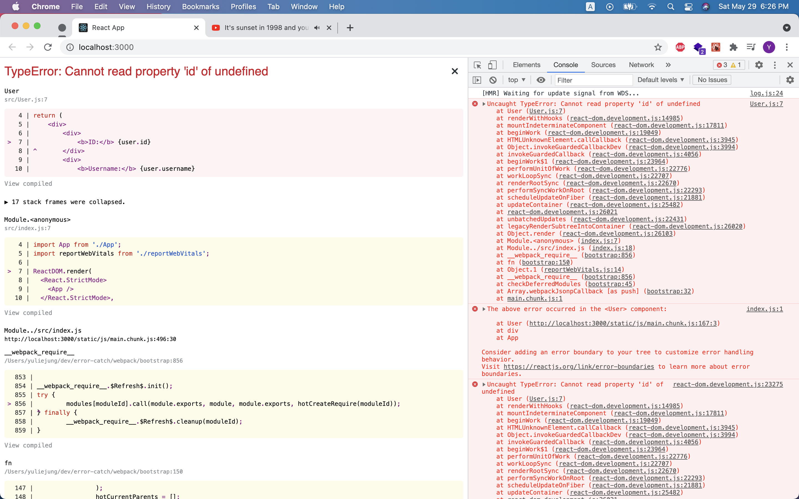
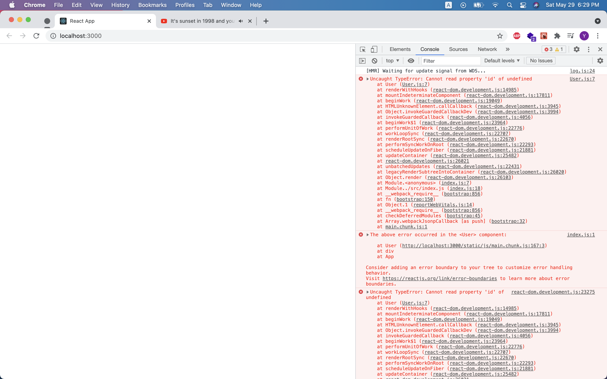
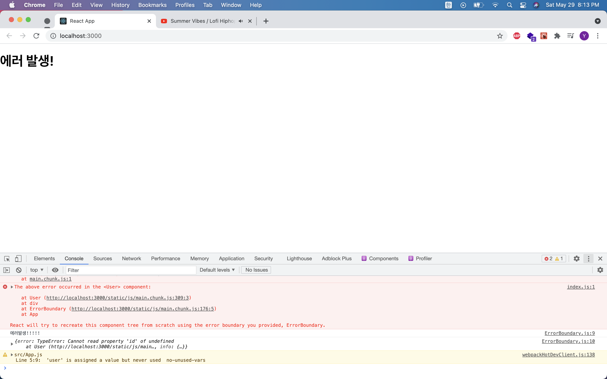
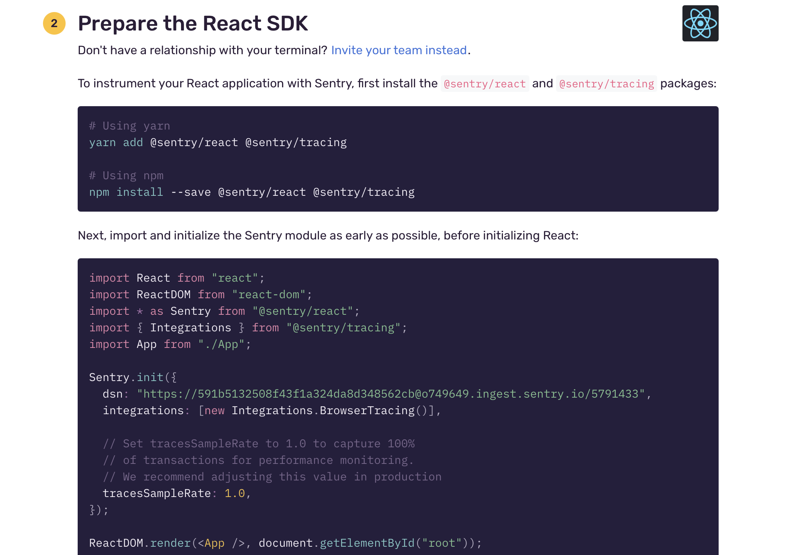
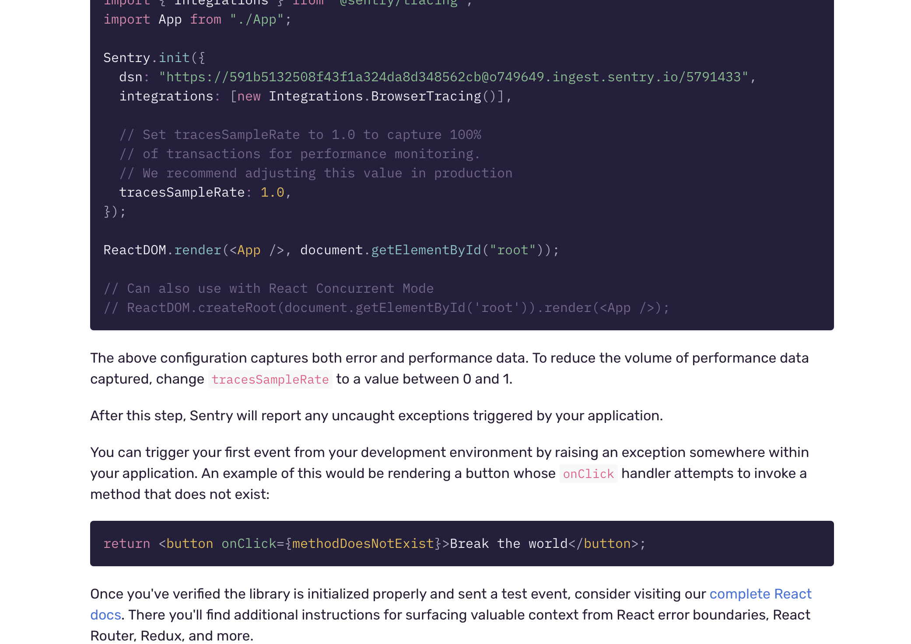
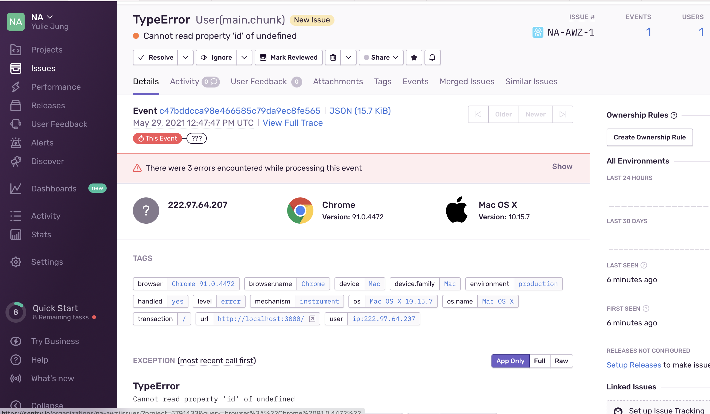

# Error Handling in React
> componentDidCatch() 메서드, Sentry 를 이용!
- Error Handling 이란 프로그래밍에서 사용되는 용어로, 프로그램에서 **예상치 못한 에러가 발생했을 경우, 어떻게 대처**할지에 관여하는 로직을 의미한다.
- 에러가 나지 않는 프로그램은 없기 때문에, 좋은 개발자라면 에러가 날 수 있는 상황을 예측해보고, 그에 따른 적절한 핸들링을 하는 코드를 포함시키는게 좋다.

## 1. React에서 Error가 발생하는 상황
컴포넌트에서 전달받은 props의 값을 사용해 디스플레이를 렌더할 경우, **해당 props가 제대로 전달되지 않았을 때**.
### 예시) User.js:
```jsx
import React from 'react';

function User({ user }) {
    return (
        <div>
            <div>
                <b>ID:</b> {user.id}
            </div>
            <div>
                <b>Username:</b> {user.username}
            </div>
        </div>
    )
}

export default User;
```
### App.js:
```jsx
import User from "./User"

function App() {
  const user = {
    id: 1,
    username: 'yulieeee'
  }

  return (
    <div>
      <User /> {/* user props를 전달해주는 걸 깜빡했다... */}
    </div>
  );
}

export default App;

```
그럼 개발환경 localhost 에서 이런 에러가 뜨게된다.
  

하지만 저 화면은 개발환경에서만 뜨는 에러로, 실제 프로덕션에서 유저는 빈 화면을 보게된다. 상단의 x버튼을 누르면:
  

# 2. 에러 방지하기
## 2-1. Null Checking

이런 에러를 방지해주기 위해, 'null checking'을 한다.

null checking 이란 전달받은 값이 ```null``` 인지 아닌지 확인한 후, 결과에 따라 다른 액션을 취하는 것을 얘기한다. 한마디로 null 일 경우엔 다르게 렌더링을 해주는 것.
```jsx
import React from 'react';

function User({ user }) {
    // user props가 전달되지 않았을 경우에
    // null을 return 해주어서 에러가 나지 않도록 한다.
    if (!user) {
        return null;
    }

    return (
        <div>
            <div>
                <b>ID:</b> {user.id}
            </div>
            <div>
                <b>Username:</b> {user.username}
            </div>
        </div>
    )
}

export default User;
```
이렇게 하면 화면에 아무것도 뜨지 않는 것은 마찬가지이지만, 적어도 에러는 뜨지 않게 된다.

보통 네트워크 요청을 통해 백엔드에서 데이터를 불러올 경우, 데이터가 다 불러와지기 전까지 일시적으로 이렇게 null 혹은 '로딩중' 같은 메시지를 렌더링하게 된다.

array 를 props 로 전달할 경우, 해당 array가 undefined 이면 당연히 내장함수 map에서 에러가 나게 된다:
```jsx
function Users({ users, onToggle }) {
  // users null checking 해주기.
  if (!users) return null;

  return (
    <ul>
      {users.map(user => (
        <li key={user.id} onClick={() => onToggle(user.id)}>
          {user.username}
        </li>
      ))}
    </ul>
  );
}

// onToggle props가 전달되지 않았을 경우,
// 디폴트 프랍을 통해 에러를 방지할 수 있다.
Users.defaultProps = {
  onToggle: () => {
    console.warn('onToggle is missing!');
  }
};
```

## 2-2. componentDidCatch() 메서드 이용
```componentDidCatch()```는 component lifecycle method 중 하나로, Error Boundary 컴포넌트 내부에서 호출된다.

**Error Boundary**란 컴포넌트 트리를 감싸주었을 때 그 속에서 발생한 에러들을 잡아주고, 로그에 기록할 수 있게 해주며, 그런 상황에서 대체할 수 있는 UI를 렌더할 수 있게 해주는 리액트 컴포넌트이다.

## Error Boundary:
- ```componentDidCatch()```는 생명주기 메서드로 클래스 컴포넌트에서만 사용할 수 있기 때문에, ErrorBoundary 라는 클래스 컴포넌트를 만들어준다.

- ***핵심요소:***
    - error 라는 state를 설정해준다.
    - ```componentDidCatch()``` 함수를 통해 에러를 로그에 기록해주고, error state 값을 바꿔준다.
    - ```render()``` 함수 즉 렌더링 하는 곳에서, error state 값에 따라서 다른 UI 를 리턴해준다.
```jsx
import { Component } from 'react';

class ErrorBoundary extends Component {
    state = {
        error: false
    };

    // error 파라미터 - 에러의 내용.
    // info 파라미터 - 에러가 발생한 위치.
    componentDidCatch(error, info) {
        console.log('에러발생!!!!!');
        console.log({
            error,
            info
        });
        this.setState({
            error: true
        });
    }

    render() {
        if (this.state.error) {
            // 에러 발생시 유저에게 보여줄 디스플레이를 렌더링.
            return <h1>에러 발생!</h1>;
        }

        // 에러 미발생시 - 바운더리가 감싸게 될 컴포넌트 트리를 렌더링.
        return this.props.children
    }
}

export default ErrorBoundary;
```

이제 에러를 잡고자 하는 컴포넌트 트리를 이 바운더리로 감싸준다.
```jsx
import ErrorBoundary from "./ErrorBoundary";
import User from "./User"

function App() {
  const user = {
    id: 1,
    username: 'yulieeee'
  }

  return (
    // 에러 바운더리로 감싸준다.
    <ErrorBoundary>
      <div>
        <User />
      </div>
    </ErrorBoundary>
  );
}

export default App;
```
이렇게 하면 브라우저에서 (개발환경에서 보이는 에러창을 닫아준후) 대체된 UI가 렌더링 된 것을 확인할 수 있고, console에 찍힌 커스텀 에러메시지도 확인할 수 있다.

  

## 장점:
- 원하는 범위를 결정해서 에러를 잡아낼 수 있다. 상위 컴포넌트를 감싸서 전반적인 에러메시지를 유저에게 보여줄 수 있고, 세세한 컴포넌트를 감싸주어 그 컴포넌트에서 에러가 발생해도 프로그램 전체가 crash하는 걸 방지할 수 있다.
- 예를 들어 페이스북 메신저는 사이드바, 패널, 대화기록 등등을 다른 바운더리로 관리해주어서 한 컴포넌트에 에러가 나도 다른 곳들은 정상 작동하게 해주었다.
- ```componentDidCatch()```안에서 로깅서비스에 에러 로그를 기록해주어서, 프로덕트의 에러를 전체적으로 모니터링 할 수 있다.
- ***주의:***
    - event handler 함수내의 에러는 잡아내지 않는다. 리액트의 에러가 아닌 자바스크립트의 에러이기 때문. 그렇기 때문에 일반 try/catch 로 에러를 핸들링 해주어야 한다.

# Sentry 연동으로 로그 모니터링
Sentry 센트리는 '어플리케이션 모니터링 플랫폼'이다. 개발자들이 소프트웨어를 진단하고 고장난 부분을 고치고 최적화하는데 도움을 준다.

회원가입후 프로젝트 생성 단계에서 리액트를 선택해준다.
  

그럼 센트리 연동 방법이 나온다.
  
  

- 나와있는 대로 패키지를 설치해준다:
```
# Using yarn
yarn add @sentry/react @sentry/tracing

# Using npm
npm install --save @sentry/react @sentry/tracing
```
- 그리고 설명에 나와있는대로 ```index.js```에 App 렌더전에, 센트리 모니터링 부분을 추가해준다.
- 윗부분에 import 도 빼먹지 말고 해줄 것.
```js
import React from 'react';
import ReactDOM from 'react-dom';
import './index.css';
import App from './App';
import reportWebVitals from './reportWebVitals';
import * as Sentry from "@sentry/react";
import { Integrations } from "@sentry/tracing";

Sentry.init({
  dsn: "https://591b5132508f43f1a324da8d348562cb@o749649.ingest.sentry.io/5791433",
  integrations: [new Integrations.BrowserTracing()],

  // Set tracesSampleRate to 1.0 to capture 100%
  // of transactions for performance monitoring.
  // We recommend adjusting this value in production
  tracesSampleRate: 1.0,
});

ReactDOM.render(
  <React.StrictMode>
    <App />
  </React.StrictMode>,
  document.getElementById('root')
);
```
- 이렇게 해주면 어플리케이션의 에러 & 성능 데이터를 센트리가 기록해주게 된다.
- 기록되는 성능 데이터의 양을 줄이려면 tracesSampleRate의 값을 0-1 사이로 설정해준다.
- 브라우저를 새로고침해서 에러를 발동시키면, 이제 센트리에서 그 내역을 확인할 수 있다.
  

하지만 개발모드일때와 다르게 실제 프로덕션에서는 ```componentDidCatch()```로 에러를 잡아줬을 경우에 Sentry로 에러 내역이 전달되지 않는다.

그렇기 때문에 다음과 같이 ```ErrorBoundary``` 컴포넌트를 수정해주어야 한다.

```jsx
import { Component } from 'react';
import * as Sentry from '@sentry/browser'; // import Sentry.

class ErrorBoundary extends Component {
    state = {
        error: false
    };

    componentDidCatch(error, info) {
        console.log('에러발생!!!!!');
        console.log({
            error,
            info
        });
        this.setState({
            error: true
        });

        // 프로덕션 배포 환경일때 수동으로 센트리에서 에러를 캡쳐하도록 해준다.
        if (process.env.NODE_ENV === 'production') {
            Sentry.captureException(error, { extra: info });
        }
    }

    render() {
        if (this.state.error) {
            return <h1>에러 발생!</h1>;
        }
        return this.props.children
    }
}

export default ErrorBoundary;
```
프로덕션 빌드에서 잘 작동하는 알아보려면 프로젝트를 빌드해준 후, 서버를 열어 빌드 파일들을 제공해준다. localhost:/5000 에 서브가 될 것이다.
```
// 빌드
$ yarn build

// 서브
$ npx serve ./build
```
그럼 센트리에서도 이제 새로운 에러가 추가된 것을 볼 수 있을 것이다.