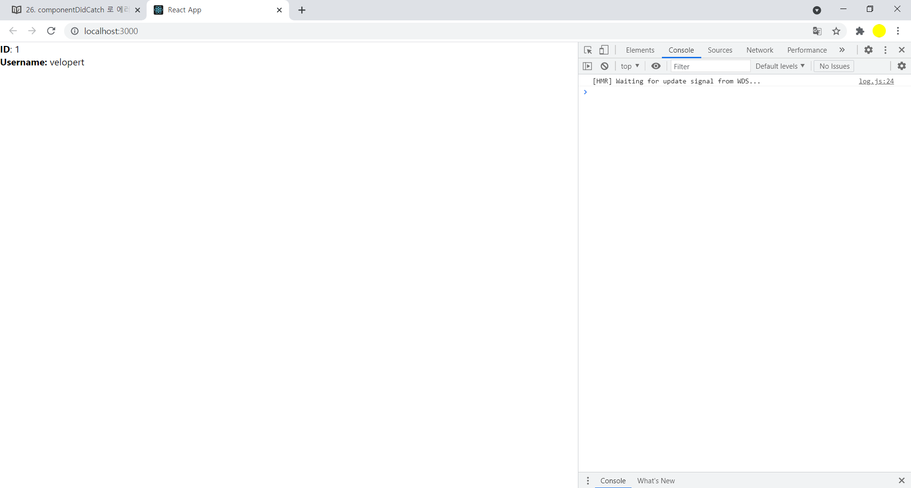
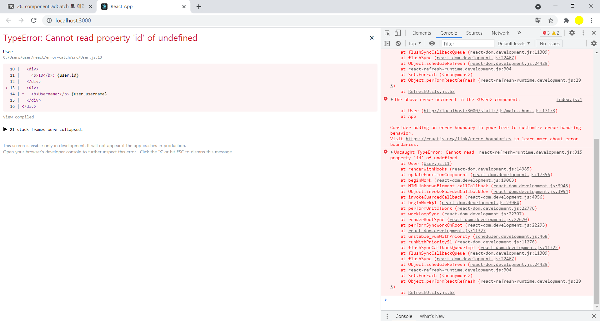
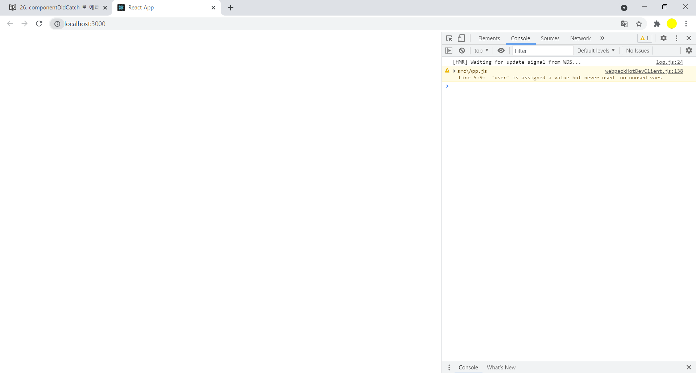
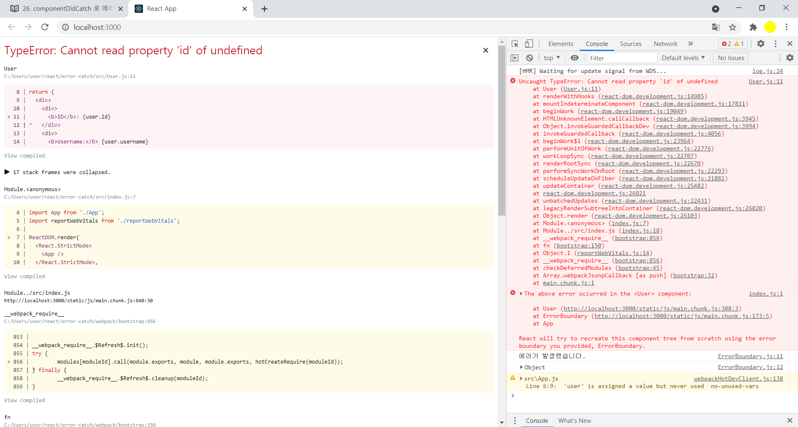
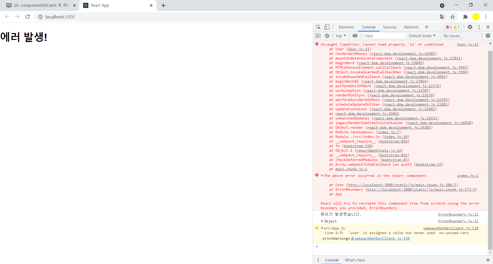
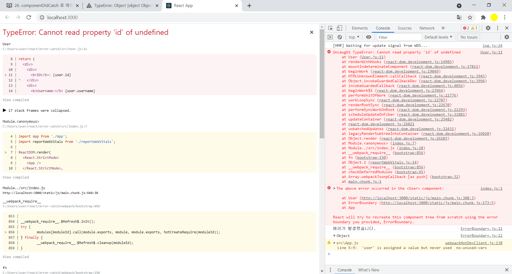

## componentDidCatch

- componentDidCatch라는 생명주기 메서드를 사용항여 리액트 어플리케이션에서 발생하는 에러처리방법 

- 에러가 발생했다는것을 알려주는 방법

- 어떤상황에 에러가 발생하고, 에러를 방지할수 있는 방밥

  

### Users.js

```react
import React from 'react';

function User({ user }) {
  
  return (
    <div>
      <div>
        <b>ID</b>: {user.id}
      </div>
      <div>
        <b>Username:</b> {user.username}
      </div>
    </div>
  );
}

export default User;
```

- 이컴포넌트는  user라는 props를 받아와서 해당데이터의 id와 username값을 보여줌

### App.js

```react
import React from 'react';
import User from './User';

function App() {
  const user = {
    id: 1,
    username: 'velopert'
  };
  return <User user={user} />;
}

export default App;
```





### App.js

```react
import React from 'react';
import User from './User';

function App() {
  const user = {
    id: 1,
    username: 'velopert'
  };
  //return <User user={user} />;
  return <User />;
}

export default App;
```


- user props를 제대로 설정하지 않았을때 에러





### User.js

```react
import React from 'react';
//null checking=> user값이 존재하지 않으면 null을 렌더링=> 아무것도 나타나지 않음
function User({ user }) {
    if (!user) {
      return null;
    }

  return (
    <div>
      <div>
        <b>ID</b>: {user.id}
      </div>
      <div>
        <b>Username:</b> {user.username}
      </div>
    </div>
  );
}

export default User;
```




## ComponentDidCatch로 에러 잡아내기


#### ErrorBoundary.js

```react
import React, { Component } from 'react';

class ErrorBoundary extends Component {
  state = {
    error: false
  };

  //error:에러의 내용
  //info:에러가 발생한 위치 
  componentDidCatch(error, info) {
    console.log('에러가 발생했습니다.');
    console.log({
      error,
      info
    });
    this.setState({
      error: true
    });
  }

  render() {
    if (this.state.error) {
      return <h1>에러 발생!</h1>;
    }
    return this.props.children;
  }
}

export default ErrorBoundary;
```


### App.js

```react
import React from 'react';
import User from './User';
import ErrorBoundary from './ErrorBoundary';

function App() {
  const user = {
    id: 1,
    username: 'velopert'
  };
  return(
  <ErrorBoundary>
    <User />
  </ErrorBoundary>
  );
}

export default App;
```

- 

### User.js

```react
import React from 'react';

function User({ user }) {
    //if (!user) {
    //  return null;
    //}

  return (
    <div>
      <div>
        <b>ID</b>: {user.id}
      </div>
      <div>
        <b>Username:</b> {user.username}
      </div>
    </div>
  );
}

export default User;
```





- 좌측상단의 x를 누르면 나타나는 화면




##  Sentry 연동

- https://sentry.io/

- 회원가입및 로그인후 새프로젝트 생성

- ```bash
  npm install --save @sentry/react  /  yarn add @sentry/react
  
  ```

### index.js

```react
import React from "react";
import ReactDOM from "react-dom";
import * as Sentry from "@sentry/react";
import App from "./App";

Sentry.init({ dsn: "https://7d2f4b9c3a0847528cbd0c1ee80ea2ab@o807744.ingest.sentry.io/5803725" });

ReactDOM.render(<App />, document.getElementById("root"));

// Can also use with React Concurrent Mode
// ReactDOM.createRoot(document.getElementById('root')).render(<App />);

```





### ErrorBoundary.js

```react
import React, { Component } from 'react';
import * as Sentry from '@sentry/browser';

class ErrorBoundary extends Component {
  state = {
    error: false
  };

  componentDidCatch(error, info) {
    console.log('에러가 발생했습니다.');
    console.log({
      error,
      info
    });
    this.setState({
      error: true
    });
    if (process.env.NODE_ENV === 'production') {
      Sentry.captureException(error, { extra: info });
    }
  }

  render() {
    if (this.state.error) {
      return <h1>에러 발생!</h1>;
    }
    return this.props.children;
  }
}

export default ErrorBoundary;
```

- npm run-script build

- npx serve ./build 

- http://localhost:5000로 production 확인

  

  
