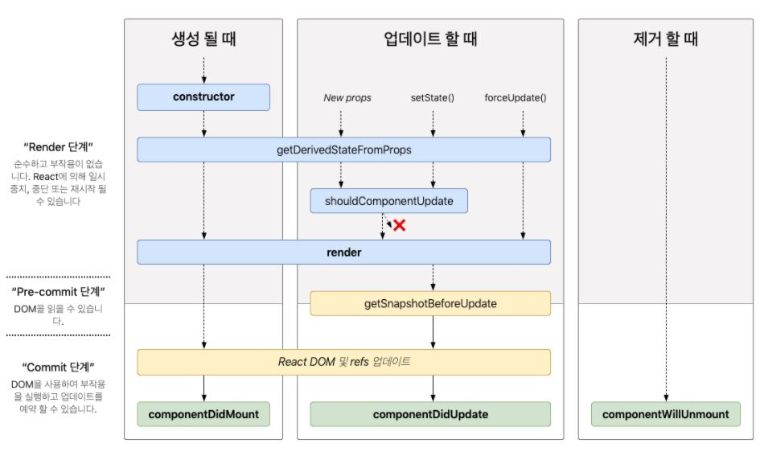

# 25. LifeCycle Method

- LifeCycle Method 는 한국어로 "생명주기 메서드" 라고 불리며, 클래스형 컴포넌트에만 사용할 수 있다.
- 생명주기 메서드는 컴포넌트가 브라우저상에 나타나고, 업데이트되고, 사라지게 될 때 호출되는 메서드들이다. 따라서 **각각의 Component들은 생성 -> 업데이트 -> 제거 단계를 차례로 겪는 생명주기(Life Cycle)를 가지고 있다.**(추가적으로 컴포넌트에서 에러가 났을 때 호출되는 메서드도 있다.)



**출처: [http://projects.wojtekmaj.pl/react-lifecycle-methods-diagram/](http://projects.wojtekmaj.pl/react-lifecycle-methods-diagram/)**

## 1. 마운트 (생성)

아래는 마운트가 될 때 발생하는 생명주기 들이다.

### 1-1. constructor

: 최초에 Component가 Mount되기 전에 실행이 된다. 주로 다음과 같은 역할을 한다.

- `this.state` 로 state 값을 선언/초기화
- 각종 Event 처리 Binding

아래와 같이 코드를 사용한다.

```jsx
class Login extends Component {
  constructor(props) {
    super(props);

    this.state = {
      isLogin = true,
      userInfo = null
    };
    this.handleBtnClick = this.handleBtnClick.bind(this);
  }
}
```

**constructor를 정의할 때 주의해야 할 점은**

1. constructor를 사용하고자 하는 목적이 없다면 작성하지 않아도 되는 코드이다.
2. constructor를 사용한다면, `super(props)` 를 반드시 호출하여 `this.props` 를 정의해 주어야 한다. 버그가 발생할 수 있다.
3. constructor 내부에서 `setState` 등의 업데이트를 실행하지 말자. 필요하다면 `state`에서 정의하면 된다. Mount 되기 전에 업데이트를 하는 것은 바람직하지 않다.

> 즉, mount되기 전에 이미 결정되는 state는 constructor에서 미리 정해 두어야 하고, 그렇지 않은 state는 mount가 된 후 setState를 통해서 이루어져야 한다.

### 1-2. getDerivedStateFromProps

- 사용할 때는 앞에 static을 필요로 한다.
- 안에서 this를 조회 할 수 없다.
- 특정 객체를 반환하게 되면 해당 객체 안에 있는 내용들이 컴포넌트의 state로 설정된다.
- null이 반환되도 아무 일이 발생하지 않는다.
- 컴포넌트의 props 나 state 가 바뀌었을때도 이 메서드가 호출된다.
- 컴포넌트가 처음 렌더링 되기 전에도 호출 되고, 그 이후 리렌더링 되기 전에도 매번 실행됩니다.

```jsx
static getDerivedStateFromProps(nextProps, prevState) {
    console.log("getDerivedStateFromProps");
    if (nextProps.color !== prevState.color) {
      return { color: nextProps.color };
    }
    return null;
  }
```

### 1-3. render

: render() 는 최종적으로 component에서 작업한 결과물을 return하는 method이다. 그래서 component 라면 반드시 있어야 하는 method이다.

```jsx
render() {
	return (
      <div>
        <header className="title">
          Hanjun Blog
        </header>
      </div>
	);
}
```

> **render 를 작성할 때 주의해야 할 사항은 다음과 같다.**

1. Render() 메소드는 순수(Pure Function)해야 한다. 여기서 순수해야한다는 의미는 같은 input에 대해서 같은 output이 나와야 한다는 것을 의미한다. 시점이나 상황에 따라 다른 결과물을 리턴하는 것을 지양해야 한다.
2. render() 메소드 안에서 setState 작업을 하면 안된다. 무한 루프에 빠질 것이다.

### 1-4. componentDidMount

- 컴포넌트의 첫번째 렌더링이 마치고 나면 호출되는 메서드이다.
- 주로 D3, masonry 처럼 DOM 을 사용해야하는 외부 라이브러리 연동을 하거나, 해당 컴포넌트에서 필요로하는 데이터를 요청하기 위해 axios, fetch 등을 통하여 ajax 요청을 하거나, DOM 의 속성을 읽거나 직접 변경하는 작업을 진행한다.

```jsx
class Clock extends React.Component {
  constructor(props) {
    super(props);
    this.state = { date: new Date() };
  }

  componentDidMount() {
    this.timerID = setInterval(() => this.tick(), 1000);
  }
  componentWillUnmount() {}

  render() {
    return (
      <div>
        <h1>Hello, world!</h1>
        <h2>It is {this.state.date.toLocaleTimeString()}.</h2>
      </div>
    );
  }
}
```

## 2. 업데이트

: 아래는 컴포넌트가 업데이트 되는 시점에서 호출되는 생명주기 메소드들이다.

### 2-1. getDerivedStateFromProps

: 마운트 때도 호출되고 업데이트에서도 호출된다.

### 2-2. render

: 마운트 때도 호출되고 업데이트에서도 호출된다.

### 2-3. shouldComponentUpdate

: 최적화 할 때 사용하는 메서드로 컴포넌트가 리렌더링을 할지 말지 결정하는 메소드

```jsx
shouldComponentUpdate(nextProps, nextState) {
    console.log("shouldComponentUpdate", nextProps, nextState);
    // 숫자의 마지막 자리가 4면 리렌더링하지 않습니다
    return nextState.number % 10 !== 4;
  }
```

### 2-4. getSnapshotBeforeUpdate

: 컴포넌트에 변화가 일어나기 직전의 DOM 상태를 가져와서 특정 값을 반환하면 그 다음 발생하게 되는 componentDidUpdate 함수에서 받아와서 사용을 할 수 있다.

```jsx
getSnapshotBeforeUpdate(prevProps, prevState) {
    console.log("getSnapshotBeforeUpdate");
    if (prevProps.color !== this.props.color) {
      return this.myRef.style.color;
    }
    return null;
  }
```

### 2-5. componentDidUpdate

: 리렌더링이 마치고, 화면에 우리가 원하는 변화가 모두 반영되고 난 뒤 호출되는 메서드이다. getSnapshotBeforeUpdate 에서 반환한 값을 조회 할 수 있다.

```jsx
componentDidUpdate(prevProps, prevState, snapshot) {
    console.log("componentDidUpdate", prevProps, prevState);
    if (snapshot) {
      console.log("업데이트 되기 직전 색상: ", snapshot);
    }
  }
```

## 3. 언마운트 (제거)

: 컴포넌트가 화면에서 사라지는것을 의미합니다. 언마운트에 관련된 생명주기 메서드는 componentWillUnmount 하나이다.

### 3-1. componentWillUnmount

: 컴포넌트가 화면에서 사라지기 직전에 호출된다.

```jsx
componentWillUnmount() {
    console.log("componentWillUnmount");
  }
```
