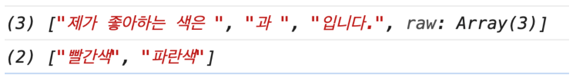

# 합성 (Composition) vs 상속 (Inheritance)

## React Composition(합성) 이란?

---

서로 다른 객체를 여러 개 붙여서 새로운 기능이나 객체를 구성합니다.

일반적으로 합성할 클래스를 변수에 할당 후 사용하는 구조이며, 상속과는 다르게 클래스간의 유기적으로 서로의 클래스를 융통성 있게 합성할 수 있습니다.

리액트는 **합성 모델**을 가지고 있으며 상속 대신 합성을 사용해컴포넌트 간에 코드를 재사용하는 것이 좋습니다.

### 컴포넌트에서 다른 컴포넌트를 담기

---

예시

```jsx
function FancyBorder(props) {
  return (
    <div className={"FancyBorder FancyBorder-" + props.color}>
      {props.children}
    </div>
  );
}
```

컴포넌트에서는 특수한 children prop을 사용하여 자식 엘리먼트를 출력에 그대로 전달하는 것이 좋습니다.

### 특수화

---

어떤 컴포넌트의 “특수한 경우”인 컴포넌트를 고려해야 하는 경우가 있습니다. 예를 들어, `WelcomeDialog`는 `Dialog`의 특수한 경우라고 할 수 있습니다. React에서는 이 역시 합성을 통해 해결할 수 있습니다. 더 “구체적인” 컴포넌트가 “일반적인” 컴포넌트를 렌더링하고 props를 통해 내용을 구성합니다.

```jsx
function Dialog(props) {
  return (
    <FancyBorder color="blue">
      <h1 className="Dialog-title">{props.title}</h1>
      <p className="Dialog-message">{props.message}</p>
    </FancyBorder>
  );
}

function WelcomeDialog() {
  return (
    <Dialog title="Welcome" message="Thank you for visiting our spacecraft!" />
  );
}
```

## **상속(Inheritance)**

다른 부모 클래스를 먼저 만든 후 자식 클래스가 부모의 클래스를 상속받습니다.

## 왜 React Composition을 사용해야 하나요?

props와 합성은 명시적이고 안전한 방법으로 컴포넌트의 모양과 동작을 커스터마이징하는데 필요한 모든 유연성을 제공합니다. 컴포넌트가 원시 타입의 값, React 엘리먼트 혹은 함수 등 어떠한 props도 받을 수 있기 때문입니다.

그래서 리액트에서는 강력한 합성 모델을 가지고 있기 때문에 상속을 사용하기 보다 합성을 사용해야합니다.

## styled-components 란?

- JS 안에 CSS 를 작성하는 것을 의미로 기존 돔을 만드는 방식인 css, scss 파일을 밖에 두고, 태그나 id, class이름으로 가져와 쓰지 않고, 동일한 컴포넌트에서 컴포넌트 이름을 쓰듯 스타일을 지정하는 것을 styled-components라고 부릅니다. css 파일을 밖에 두지 않고, 컴포넌트 내부에 넣기 때문에, css가 전역으로 중첩되지 않도록 만들어주는 장점이 있습니다.
- styled-components 는 현존하는 CSS in JS 관련 리액트 라이브러리 중에서 가장 인기 있는 라이브러리입니다. 이에 대한 대안으로는 emotion 와 styled-jsx가 있습니다.

## Tagged Template Literal

styled-components 에서는 스타일을 입력 할 때 Tagged 템플릿 리터럴(Template Literal) 이라는 ES6 문법을 사용합니다. 이 문법을 사용하는 이유는, `` 를 사용할 때 내부에 JavaScript 객체나 함수가 전달 될 때 이를 따로 추출하기 위함입니다.

```jsx
const red = "빨간색";
const blue = "파란색";
function favoriteColors(texts, ...values) {
  console.log(texts);
  console.log(values);
}
favoriteColors`제가 좋아하는 색은 ${red}과 ${blue}입니다.`;
```



styled-components 에서는 아래 문법을 사용해서 컴포넌트의 props 를 읽어옵니다.

```jsx
const StyledDiv = styled`
  background: ${(props) => props.color};
`;
```

# styled-components 사용하기

### **환경설정**

```jsx
$ npm install styled-components
```

## **styled components 만들기**

- `const 컴포넌트명 = styled.태그명` 으로 스타일을 입력함과 동시에 해당 스타일을 가진 컴포넌트를 만들 수 있습니다.
- styled-component는 내부적으로 props을 받을 수 있고, 그 props에 따라 스타일을 변경할 수 있습니다.
- 여러 줄의 CSS 코드를 조건부로 보여주고 싶다면 css 를 사용해야합니다. css 를 불러와서 사용을 해야 그 스타일 내부에서도 다른 props 를 조회 할 수 있습니다.

```jsx
import React from "react";
import styled, { css } from "styled-components";

const Circle = styled.div`
  width: 5rem;
  height: 5rem;
  background: ${(props) => props.color || "black"};
  border-radius: 50%;
  ${(props) =>
    props.huge &&
    css`
      width: 10rem;
      height: 10rem;
    `}
`;

function App() {
  return <Circle color="red" huge />;
}

export default App;
```


## polished의 스타일 관련 유틸 함수 사용하기

CSS in JS에서 색상 변화를 줄 수 있는 유틸 함수를 사용하고 싶다면 polished 라는 라이브러리를 사용하면 됩니다.

### 환경설정

```jsx
$ npm add polished
```

**예시**

```jsx
import React from "react";
import styled from "styled-components";
import { darken, lighten } from "polished";

const StyledButton = styled.button`
  /* 공통 스타일 */
  display: inline-flex;
  outline: none;
  border: none;
  border-radius: 4px;
  color: white;
  font-weight: bold;
  cursor: pointer;
  padding-left: 1rem;
  padding-right: 1rem;

  /* 크기 */
  height: 2.25rem;
  font-size: 1rem;

  /* 색상 */
  background: #228be6;
  &:hover {
    background: ${lighten(0.1, "#228be6")};
  }
  &:active {
    background: ${darken(0.1, "#228be6")};
  }

  /* 기타 */
  & + & {
    margin-left: 1rem;
  }
`;

function Button({ children, ...rest }) {
  return <StyledButton {...rest}>{children}</StyledButton>;
}

export default Button;
```

## **트랜지션 구현하기**

Dialog 가 나타나거나 사라질 때 트랜지션 효과를 적용해보겠습니다. 트랜지션 효과를 적용 할 때에는 [CSS Keyframe](https://developer.mozilla.org/ko/docs/Web/CSS/@keyframes) 을 사용하며, styled-components 에서 이를 사용 할 때에는 `[keyframes](https://www.styled-components.com/docs/api#keyframes)` 라는 유틸을 사용합니다.

**예시**

```jsx
import React from "react";
import styled, { keyframes } from "styled-components";
import Button from "./Button";

const fadeIn = keyframes`
  from {
    opacity: 0
  }
  to {
    opacity: 1
  }
`;

const slideUp = keyframes`
  from {
    transform: translateY(200px);
  }
  to {
    transform: translateY(0px);
  }
`;

const DarkBackground = styled.div`
  position: fixed;
  left: 0;
  top: 0;
  width: 100%;
  height: 100%;
  display: flex;
  align-items: center;
  justify-content: center;
  background: rgba(0, 0, 0, 0.8);

  animation-duration: 0.25s;
  animation-timing-function: ease-out;
  animation-name: ${fadeIn};
  animation-fill-mode: forwards;
`;

const DialogBlock = styled.div`
  width: 320px;
  padding: 1.5rem;
  background: white;
  border-radius: 2px;
  h3 {
    margin: 0;
    font-size: 1.5rem;
  }
  p {
    font-size: 1.125rem;
  }

  animation-duration: 0.25s;
  animation-timing-function: ease-out;
  animation-name: ${slideUp};
  animation-fill-mode: forwards;
`;

const ButtonGroup = styled.div`
  margin-top: 3rem;
  display: flex;
  justify-content: flex-end;
`;

const ShortMarginButton = styled(Button)`
  & + & {
    margin-left: 0.5rem;
  }
`;

function Dialog({
  title,
  children,
  confirmText,
  cancelText,
  onConfirm,
  onCancel,
  visible,
}) {
  if (!visible) return null;
  return (
    <DarkBackground>
      <DialogBlock>
        <h3>{title}</h3>
        <p>{children}</p>
        <ButtonGroup>
          <ShortMarginButton color="gray" onClick={onCancel}>
            {cancelText}
          </ShortMarginButton>
          <ShortMarginButton color="pink" onClick={onConfirm}>
            {confirmText}
          </ShortMarginButton>
        </ButtonGroup>
      </DialogBlock>
    </DarkBackground>
  );
}

Dialog.defaultProps = {
  confirmText: "확인",
  cancelText: "취소",
};

export default Dialog;
```

참고 문서: [https://formidable.com/blog/2021/react-composition/](https://formidable.com/blog/2021/react-composition/)
