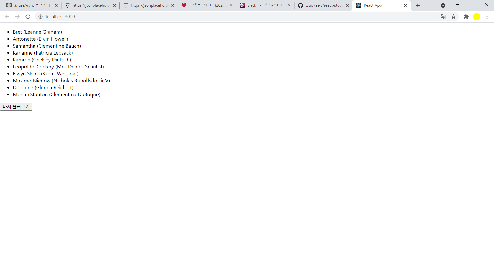
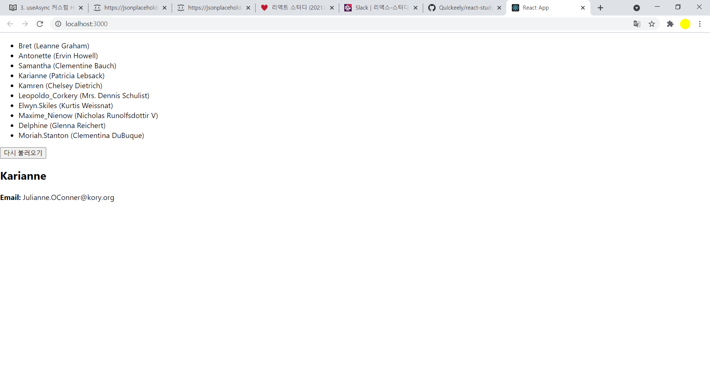

## useAsync 커스텀 Hook 만들어서 사용하기

- 매번 반복되는 코드를 작성하는 대신에 Custom Hook를 만들어서 요청상태 관리로직을 쉽게 재사용하는 방법
- 이 Hook에서 반환하는 값은 요청 관련상태와 ,fetchData함수 -> fecthData함수를 반환하여 나중에 쉽게 데이터를 리로딩해줌


#### useAsync.js

```react
import { useReducer, useEffect } from 'react';

function reducer(state, action) {
  switch (action.type) {
    case 'LOADING':
      return {
        loading: true,
        data: null,
        error: null
      };
    case 'SUCCESS':
      return {
        loading: false,
        data: action.data,
        error: null
      };
    case 'ERROR':
      return {
        loading: false,
        data: null,
        error: action.error
      };
    default:
      throw new Error(`Unhandled action type: ${action.type}`);
  }
}

//특정버튼을 누른 시점에 api를 요청하기 위해 파라미터 skip 추가
function useAsync(callback, deps = [], skip = false) {
  const [state, dispatch] = useReducer(reducer, {
    loading: false,
    data: null,
    error: false
  });

  const fetchData = async () => {
    dispatch({ type: 'LOADING' });
    try {
      const data = await callback();
      dispatch({ type: 'SUCCESS', data });
    } catch (e) {
      dispatch({ type: 'ERROR', error: e });
    }
  };

  useEffect(() => {
    if (skip) return;
    fetchData();
  }, deps);

  return [state, fetchData];
}

export default useAsync;
```


### Users.js

```react
import React from 'react';
import axios from 'axios';
import useAsync from './useAsync';

async function getUsers() {
  const response = await axios.get(
    'https://jsonplaceholder.typicode.com/users'
  );
  return response.data;
}

function Users() {
  const [state, refetch] = useAsync(getUsers, [], true);

  //useAsync의 세번째 파라미터에 true 를 넣어줬고, !users 인 상황에 불러오기 버튼을 렌더링해줌.
  const { loading, data: users, error } = state; // state.data 를 users 키워드로 조회

  if (loading) return <div>로딩중..</div>;
  if (error) return <div>에러가 발생했습니다</div>;
  if (!users) return <button onClick={refetch}>불러오기</button>;
  return (
    <>
      <ul>
        {users.map(user => (
          <li key={user.id}>
            {user.username} ({user.name})
          </li>
        ))}
      </ul>
      <button onClick={refetch}>다시 불러오기</button>
    </>
  );
}

export default Users;
```




### API에 파라미터가 필요한 경우

-  id값을 props로 받아와서 http://..../users/1 처럼 맨뒤에 id를 넣어서 API 요청
- `useAsync` 를 사용 할 때, 파라미터를 포함시켜서 함수를 호출하는 새로운 함수를 생성후 등록
- `id` 가 바뀔 때 마다 재호출 되도록 `deps` 에 `id` 를 넣어줌
-  Users.js 에서 `useState` 를 사용하여 `userId` 상태를 관리 => 초깃값은 `null`,   리스트에 있는 항목을 클릭하면 클릭한 사용자의 `id` 를 `userId` 값으로 설정


### User.js

```react
import React from 'react';
import axios from 'axios';
import useAsync from './useAsync';

async function getUser(id) {
  const response = await axios.get(
    `https://jsonplaceholder.typicode.com/users/${id}`
  );
  return response.data;
}

function User({ id }) {
  const [state] = useAsync(() => getUser(id), [id]);
  const { loading, data: user, error } = state;

  if (loading) return <div>로딩중..</div>;
  if (error) return <div>에러가 발생했습니다</div>;
  if (!user) return null;

  return (
    <div>
      <h2>{user.username}</h2>
      <p>
        <b>Email:</b> {user.email}
      </p>
    </div>
  );
}

export default User;
```


### Users.js

```react
import React, { Component } from 'react';

class Counter extends Component {
  handleIncrease = () => {
    console.log('increase');
    console.log(this);
  };

  handleDecrease = () => {
    console.log('decrease');
  };

  render() {
    return (
      <div>
        <h1>0</h1>
        <button onClick={this.handleIncrease}>+1</button>
        <button onClick={this.handleDecrease}>-1</button>
      </div>
    );
  }
}

export default Counter;

```





## react-async로 요청상태 관리하기

- yarn add react-async

- npm install react-async

  

### react-async README

```react
import { useAsync } from "react-async"

const loadCustomer = async ({ customerId }, { signal }) => {
  const res = await fetch(`/api/customers/${customerId}`, { signal })
  if (!res.ok) throw new Error(res)
  return res.json()
}

const MyComponent = () => {
  const { data, error, isLoading } = useAsync({ promiseFn: loadCustomer, customerId: 1 })
  if (isLoading) return "Loading..."
  if (error) return `Something went wrong: ${error.message}`
  if (data)
    return (
      <div>
        <strong>Loaded some data:</strong>
        <pre>{JSON.stringify(data, null, 2)}</pre>
      </div>
    )
  return null
}
```


- `useAsync` 를 사용 할 때 파라미터로 넣는 옵션 객체에는 호출 할 함수 `promiseFn` 을 넣고, 파라미터도 필드 이름과 함께 (`customerId`) 넣어주어야 한다

  


### User.js

```react
import React from 'react';
import axios from 'axios';
import { useAsync } from 'react-async';

async function getUser({ id }) {
  const response = await axios.get(
    `https://jsonplaceholder.typicode.com/users/${id}`
  );
  return response.data;
}

function User({ id }) {
  const { data: user, error, isLoading } = useAsync({
    promiseFn: getUser,
    id,
    watch: id
  });

  if (isLoading) return <div>로딩중..</div>;
  if (error) return <div>에러가 발생했습니다</div>;
  if (!user) return null;

  return (
    <div>
      <h2>{user.username}</h2>
      <p>
        <b>Email:</b> {user.email}
      </p>
    </div>
  );
}

export default User;
```

- useAsync사용시 promise반환하는 함수의 파라미터를 객체형태로 해주어야 한다

  ```javascript
  async function getUser({ id }) {}
  ```

- useAsync사용시 watch값에 특정값을 넣어주면 이값이 바뀔때마다 promiseFn에 넣은 함수를 다시 호출해줌
- 좀더 복잡한 비교를 해야하는경우 watchFn을 사용한다


### Users.js

```react
import React, { useState } from 'react';
import axios from 'axios';
import { useAsync } from 'react-async';
import User from './User';

async function getUsers() {
  const response = await axios.get(
    'https://jsonplaceholder.typicode.com/users'
  );
  return response.data;
}

function Users() {
  const [userId, setUserId] = useState(null);
  const { data: users, error, isLoading, reload } = useAsync({
    promiseFn: getUsers
  });

  if (isLoading) return <div>로딩중..</div>;
  if (error) return <div>에러가 발생했습니다</div>;
  if (!users) return <button onClick={reload}>불러오기</button>;
  return (
    <>
      <ul>
        {users.map(user => (
          <li
            key={user.id}
            onClick={() => setUserId(user.id)}
            style={{ cursor: 'pointer' }}
          >
            {user.username} ({user.name})
          </li>
        ))}
      </ul>
      <button onClick={reload}>다시 불러오기</button>
      {userId && <User id={userId} />}
    </>
  );
}

export default Users;
```


##  정리

- Hook을 직접 만들어서 쓸까? 라이브러리로 불러와서 사용해야 할까?
