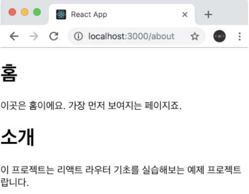
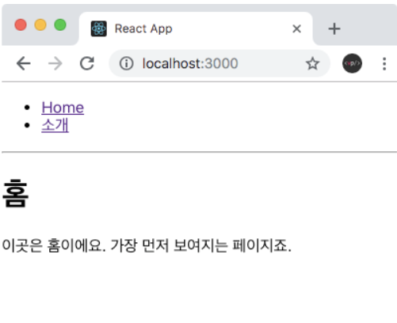
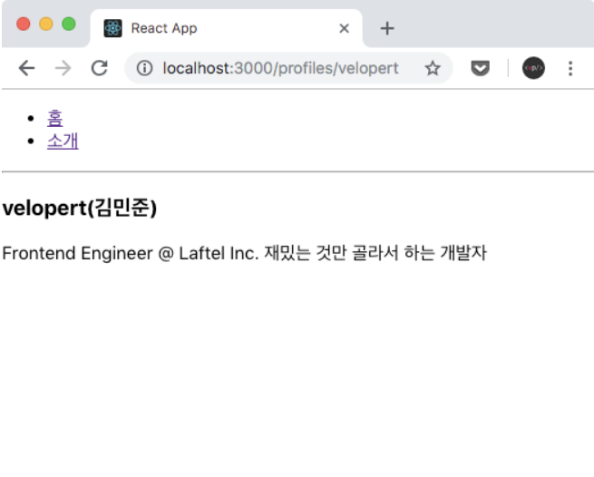
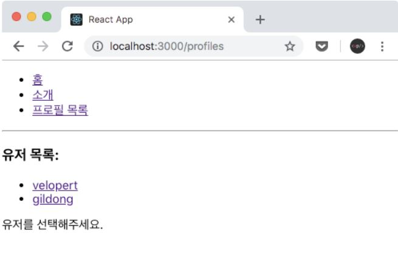
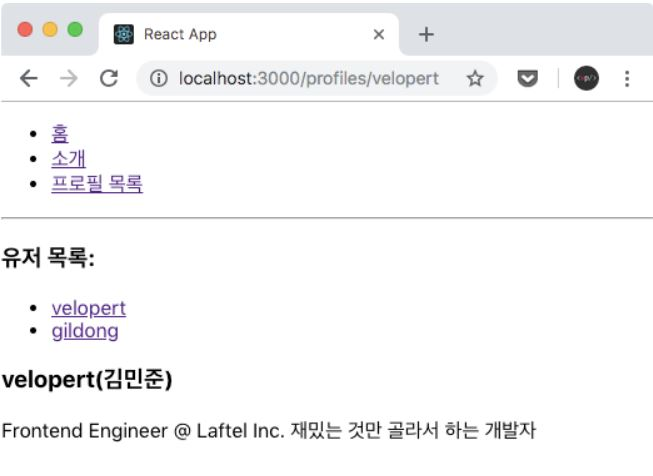

# 1. 리액트 라우터 사용법

## 1-1. 환경 설정

```jsx
$ yarn add react-router-dom
```

## 1-2. 프로젝트에 라우터 적용

라우터 적용은 index.js 에서 BrowserRouter 라는 컴포넌트를 사용하여 구현하시면 됩니다.

```jsx
import React from "react";
import ReactDOM from "react-dom";
import { BrowserRouter } from "react-router-dom"; // * BrowserRouter 불러오기
import "./index.css";
import App from "./App";
import * as serviceWorker from "./serviceWorker";

// * App 을 BrowserRouter 로 감싸기
ReactDOM.render(
  <BrowserRouter>
    <App />
  </BrowserRouter>,
  document.getElementById("root")
);

serviceWorker.unregister();
```

## 1-3. 페이지 만들기

아래는 코드는 라우트로 사용할 페이지 컴포넌트로 웹사이트에 가장 처음 들어왔을 때 보여줄Home 컴포넌트 , About 컴포넌트 입니다.

**src/Home.js**

```jsx
import React from "react";

const Home = () => {
  return (
    <div>
      <h1>홈</h1>
      <p>이곳은 홈이에요. 가장 먼저 보여지는 페이지죠.</p>
    </div>
  );
};

export default Home;
```

**src/About.js**

```jsx
import React from "react";

const About = () => {
  return (
    <div>
      <h1>소개</h1>
      <p>이 프로젝트는 리액트 라우터 기초를 실습해보는 예제 프로젝트랍니다.</p>
    </div>
  );
};

export default About;
```

## 1-4. Route: 특정 주소에 컴포넌트 연결하기

사용자가 요청하는 주소에 따라 다른 컴포넌트를 보여주는데 이 때 Route 라는 컴포넌트를 사용합니다.

```jsx
<Route path="주소규칙" component={보여주고싶은 컴포넌트}>
```

**src/App.js**

```jsx
import React from "react";
import { Route } from "react-router-dom";
import About from "./About";
import Home from "./Home";

const App = () => {
  return (
    <div>
      <Route path="/" component={Home} />
      <Route path="/about" component={About} />
    </div>
  );
};

export default App;
```


위 화면은 HOME에서 보여지는 화면입니다.

아래는 /about 경로로 들어가서 본 화면에서는 두 컴포넌트가 같이 보이는데 이유는 /about 경로가 Home / 규칙과 일치하기 때문입니다. 이를 고치기 위해선 Home 을 위한 라우트에 exact 라는 props 를 true 로 설정해야 합니다.



```jsx
// src/App.js 파일 Home 컴포넌트에 exact 추가
<Route path="/" exact={true} component={Home} />
```

## 1-5. Link: 누르면 다른 주소로 이동시키기

리액트 라우터를 사용할 때는 일반 <a href="...">...</a> 를 사용하면 안 됩니다. 만약에 a태그를 사용하려면 onClick 에 e.preventDefault() 를 호출하고 따로 자바스크립트로 주소를 변환시켜주어야 합니다

그래서 a태그 대신에 라우터에서는 Link 라는 컴포넌트를 사용해야합니다. 이 컴포넌트는 HTML5 History API 를 사용하여 브라우저의 주소만 바꿀뿐 페이지를 새로 불러오지는 않습니다.

**src/App.js**

```jsx
import React from "react";
import { Route, Link } from "react-router-dom";
import About from "./About";
import Home from "./Home";

const App = () => {
  return (
    <div>
      <ul>
        <li>
          <Link to="/">홈</Link>
        </li>
        <li>
          <Link to="/about">소개</Link>
        </li>
      </ul>
      <hr />
      <Route path="/" exact={true} component={Home} />
      <Route path="/about" component={About} />
    </div>
  );
};

export default App;
```



# 2. 파라미터와 쿼리

페이지 주소를 정의할 때는 파라미터와 쿼리로 나눠질 수 있습니다.

```jsx
파라미터: /profiles/velopert
쿼리: /about?details=true
```

일반적으로 파라미터는 특정 id 나 이름을 가지고 조회를 할 때 사용하고, 쿼리의 경우엔 어떤 키워드를 검색하거나, 요청을 할 때 필요한 옵션을 전달 할 때 사용됩니다.

## 2-1. URL Params

`/profile/velopert` 뒷부분에 username 을 넣어줄 때 해당 값을 파라미터로 받아 올 경우, match 안에 들어있는 params 값을 참조합니다.

[match] 객체안에는 현재의 주소가 `Route` 컴포넌트에서 정한 규칙과 어떻게 일치하는지에 대한 정보가 들어있습니다.

**src/Profile.js**

```jsx
import React from "react";

// 프로필에서 사용 할 데이터
const profileData = {
  velopert: {
    name: "김민준",
    description:
      "Frontend Engineer @ Laftel Inc. 재밌는 것만 골라서 하는 개발자",
  },
  gildong: {
    name: "홍길동",
    description: "전래동화의 주인공",
  },
};

const Profile = ({ match }) => {
  // 파라미터를 받아올 땐 match 안에 들어있는 params 값을 참조합니다.
  const { username } = match.params;
  const profile = profileData[username];
  if (!profile) {
    return <div>존재하지 않는 유저입니다.</div>;
  }
  return (
    <div>
      <h3>
        {username}({profile.name})
      </h3>
      <p>{profile.description}</p>
    </div>
  );
};

export default Profile;
```

Profile 을 App 컴포넌트에 적용할 때, path 규칙에는 `/profiles/:username` 이라고 넣어주면 username 에 해당하는 값을 파라미터로 넣어주어서 Profile 컴포넌트에서 match props 를 통하여 전달받을 수 있게 됩니다.

**src/App.js**

```jsx
import React from "react";
import { Route, Link } from "react-router-dom";
import About from "./About";
import Home from "./Home";
import Profile from "./Profile";

const App = () => {
  return (
    <div>
      <ul>
        <li>
          <Link to="/">홈</Link>
        </li>
        <li>
          <Link to="/about">소개</Link>
        </li>
      </ul>
      <hr />
      <Route path="/" exact={true} component={Home} />
      <Route path="/about" component={About} />
      <Route path="/profiles/:username" component={Profile} />
    </div>
  );
};

export default App;
```



## 2-2. Query

React Query는 React의 누락 된 데이터를 가져 오는 라이브러리로 설명되지만 더 기술적으로보면 React 애플리케이션에서 **서버 상태** 를 **가져오고, 캐시하고, 동기화하고, 업데이트** 하는 작업을 수월하게 해줍니다.

**환경설치**

```jsx
$ yarn add qs
```

쿼리는 라우트 컴포넌트에게 props 전달되는 location 객체에 있는 search 값에서 읽어올 수 있습니다. location 객체는 현재 앱이 갖고있는 주소에 대한 정보를 지니고있습니다.

```jsx
{
  key: 'ac3df4', // not with HashHistory!
  pathname: '/somewhere'
  search: '?some=search-string',
  hash: '#howdy',
  state: {
    [userDefined]: true
  }

```

아래 예시는 About 컴포넌트에서 search 값에있는 detail 값을 받아와서, 해당 값이 true 일때 추가정보를 보여주도록 구현하는 코드입니다.

**src/About.js**

```jsx
import React from "react";
import qs from "qs";

const About = ({ location }) => {
  const query = qs.parse(location.search, {
    ignoreQueryPrefix: true,
  });
  const detail = query.detail === "true"; // 쿼리의 파싱결과값은 문자열입니다.

  return (
    <div>
      <h1>소개</h1>
      <p>이 프로젝트는 리액트 라우터 기초를 실습해보는 예제 프로젝트랍니다.</p>
      {detail && <p>추가적인 정보가 어쩌고 저쩌고..</p>}
    </div>
  );
};

export default About;
```


# 3. 서브라우트

서브 라우트는, 라우트 내부의 라우트를 만드는것을 의미합니다. 서브라우트를 만드는 방법은 컴포넌트를 만들어서 그 안에 또 Route 컴포넌트를 렌더링하면 됩니다.

## 3-1. 서브 라우트 만들어보기

Route 컴포넌트에서는 `component` 대신에 `render` 가 사용하였지만 서브 라우트는 컴포넌트가 아니라, JSX 자체를 렌더링 할 수 있습니다. JSX 를 렌더링하는 것이기에, 상위 영역에서 props 나 기타 값들을 필요하면 전달 해 줄 수있습니다.

**src/Profiles.js**

```jsx
import React from "react";
import { Link, Route } from "react-router-dom";
import Profile from "./Profile";

const Profiles = () => {
  return (
    <div>
      <h3>유저 목록:</h3>
      <ul>
        <li>
          <Link to="/profiles/velopert">velopert</Link>
        </li>
        <li>
          <Link to="/profiles/gildong">gildong</Link>
        </li>
      </ul>

      <Route
        path="/profiles"
        exact
        render={() => <div>유저를 선택해주세요.</div>}
      />
      <Route path="/profiles/:username" component={Profile} />
    </div>
  );
};

export default Profiles;
```

아래 예시는 App 에서 Profiles 를 위한 링크와 라우트를 생성해주고기존 Profiles 라우트는 제거한 코드입니다.

```jsx
import React from "react";
import { Route, Link } from "react-router-dom";
import About from "./About";
import Home from "./Home";
import Profiles from "./Profiles";

const App = () => {
  return (
    <div>
      <ul>
        <li>
          <Link to="/">홈</Link>
        </li>
        <li>
          <Link to="/about">소개</Link>
        </li>
        <li>
          <Link to="/profiles">프로필 목록</Link>
        </li>
      </ul>
      <hr />
      <Route path="/" exact={true} component={Home} />
      <Route path="/about" component={About} />
      <Route path="/profiles" component={Profiles} />
    </div>
  );
};

export default App;
```



