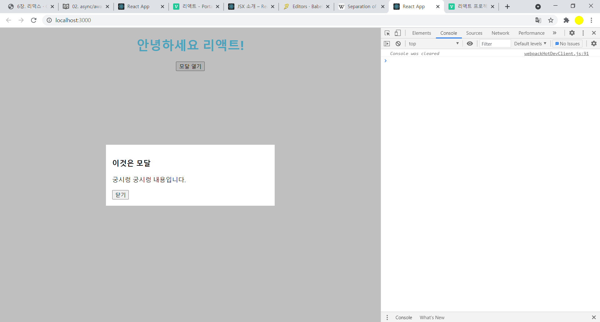

## react Portal

- Portals는 컴포넌트를 렌더링할때 , UI를 어디에 렌더링시킬지 DOM을 사전에 선택하여 부모 컴포넌트 바깥에 렌더링해주는 기능

- DOM계증구조 시스템에 종속되지 않으면서 컴포넌트를 렌더링 할 수 있다.

  

### MordalPortal.js

```react
import ReactDOM from 'react-dom';

const ModalPortal = ({ children }) => {
  const el = document.getElementById('modal');
  return ReactDOM.createPortal(children, el);
};

export default ModalPortal;
```


### MyModal.js

```react
import React from 'react';
import './MyModal.css';

const MyModal = ({ onClose })  => {
  return (
    <div className="MyModal">
      <div className="content">
        <h3>이것은 모달</h3>
        <p>궁시렁 궁시렁 내용입니다.</p>
        <button onClick={onClose}>닫기</button>
      </div>
    </div>
  );
};

export default MyModal;
```


### App.js

```react
import React, { Component } from 'react';
import MyModal from './MyModal';
import ModalPortal from './ModalPortal';
import './App.css';

class App extends Component {
  state = {
    modal: false
  };
  handleOpenModal = () => {
    this.setState({
      modal: true
    });
  };
  handleCloseModal = () => {
    this.setState({
      modal: false
    });
  };
  render() {
    return (
      <div className="App">
        <h1>안녕하세요 리액트!</h1>
        <button onClick={this.handleOpenModal}>모달 열기</button>
        {this.state.modal && (
          <ModalPortal>
            <MyModal onClose={this.handleCloseModal} />
          </ModalPortal>
        )}
      </div>
    );
  }
}

export default App;
```





###  정리

- 리액트의 Portals 기능을 사용하게되면, 렌더링을 원하는 DOM 에 할수있다.  타겟 DOM 이 꼭 App 바깥이 아니여도 가능하며 리액트 앱내부에서 원래 있어야하는 곳 말고 다른곳에 렌더링하고 싶을때도 동일한 방식으로 하면 된다.
-  모달 같은 컴포넌트를 만들게 될 때 스타일 관련해서 문제를 겪게 된다면 Portal 을 활용.


## Code Spltting(코드분할)

- 런타임에 여러 번들을 동적으로 만들고 불러오는것

- Webpack, Rollup과 Browserify 같은 번들러가 지원하는 기능

- 지금 당장 필요한 코드가 아니라면 분리시켜서, 나중에 필요할때 불러와서 사용, 현재필요한 모듈만 로딩(lazy-load) -> 페이지 로딩속도 개선효과

   

### Dynamic Imports

```react
/* 
import { add } from './math';

console.log(add(16, 26));
*/

import("./math").then(math => {
  console.log(math.add(16, 26));
});
```


### Code Splitting in React

- React.lazy 또는 Loadable Component를 사용(react 16.6.0+)
- HOC를 이용하여 asyncComponent를 생성하여 사용하거나 react-lodable library이용(그 이전버전)


####  The Async Component HOC

- 비동기적으로 컴포넌트를 import하기 위한 HOC(Higher-Order Component)를 작성한다.

  

```react
import React from 'react';

const asyncComponent = importComponent => {
  class AsyncComponent extends React.Component {
    constructor(props) {
      super(props);

      this.state = {
        component: null,
      };
    }

    componentDidMount() {
      importComponent()
        .then(({ default: component }) => this.setState({ component }));
    }

    render() {
      const { component: Component } = this.state;
      return Component ? <Component {...this.props} /> : null;
    }
  }

  return AsyncComponent;
};

export default asyncComponent;
```


- 이와 같이 작성한 코드를 router에 다음과 같이 적용

  

```react
import React from 'react';
import { Switch, Route, withRouter, Link } from 'react-router-dom';
import lazy from "./components/AsyncComponent";

const Card = lazy(() => import('./Card'));

function WithLazyLoad({ match }) {
  const routes = {
    card: `${match.path}/card`,
  };

  return (
    <React.Fragment>
      <ul>
        <li><Link to={routes.card}>card</Link></li>
      </ul>

	  <Switch>
    	    <Route path={routes.card} component={Card} />
      </Switch>
    </React.Fragment>
  );
};

export default withRouter(WithLazyLoad);
```


#### React.lazy & Suspend

- React 16.6.0 버전에서 릴리즈된 기능
- React.lazy와 Suspend는 서버사이드 렌더링을 지원하지 않는다.
- Suspense` 컴포넌트를 사용하여, 동적으로 불러온 컴포넌트가 로드되지 않은 경우 **로딩중**과 같은 fallback content 표현이 가능하다.

```react
import React, { Suspense, lazy } from 'react';
import { Switch, Route, withRouter, Link } from 'react-router-dom';

const Card = lazy(() => import(
	/* webpackChunkName: "my-chunk-name" */
	/* webpackPrefetch: true */
	'./Card'
));

function WithLazyLoad({ match }) {
  const routes = {
    card: `${match.path}/card`,
  };

  return (
    <React.Fragment>
      <ul>
        <li><Link to={routes.card}>card</Link></li>
      </ul>

	  <Suspense fallback={<div>Loading...</div>}>
	      <Switch>
    	    <Route path={routes.card} component={Card} />
	      </Switch>
	  </Suspense>
    </React.Fragment>
  );
}

export default withRouter(WithLazyLoad);
```


- React.lazy를 React Router와 함께 사용하기 위해서는 react-router-dom 4.4+ 업데이트 필요


#### Loadable Components

- Loadable Components는 SSR 환경에서도 dynamic import를 사용할 수 있게 지원한다.
- 2019년 1월 이전에는 React 공식문서에서 code splitting을 위해 권장하는 외부 모듈을 react-loadable에서 lodable components로 변경이 되었다.
- react-loadable이 Webpack v4+과 Babel v7+에 더이상 호환이 되지 않으며, 유지보수가 되지 않는 문제가 있다고함.
- @loadable/component를 react-router-dom 4.3.x 이하 버전과 사용 시 React.lazy와 브라우저 콘솔에 동일한 오류 메시지가 발생하나 정상적으로 동작은 함. (react-router-dom 4.4+으로 설치하면 해당 에러는 발생하지 않음.)
- React.lazy의 경우 SSR을 지원하지 않으므로, SSR로 프로젝트를 구성하는 경우에 lodable을 이용하여 Code Splitting을 적용할 수 있다.


```react
import React from 'react';
import { Switch, Route, withRouter, Link } from 'react-router-dom';
import lodable from '@loadable/component';

const Card = lodable(() => import(
  /* webpackChunkName: "card" */
  /* webpackPrefetch: true */
  './Card'
));

function WithLazyLoad({ match }) {
  const routes = {
    card: `${match.path}/lazy/card`,
  };

  return (
    <React.Fragment>
      <ul>
        <li><Link to={routes.card}>card</Link></li>
      </ul>

      <Switch>
        <Route exact path={routes.card} component={Card} />
      </Switch>
    </React.Fragment>
  );
}

export default withRouter(WithLazyLoad);


```

