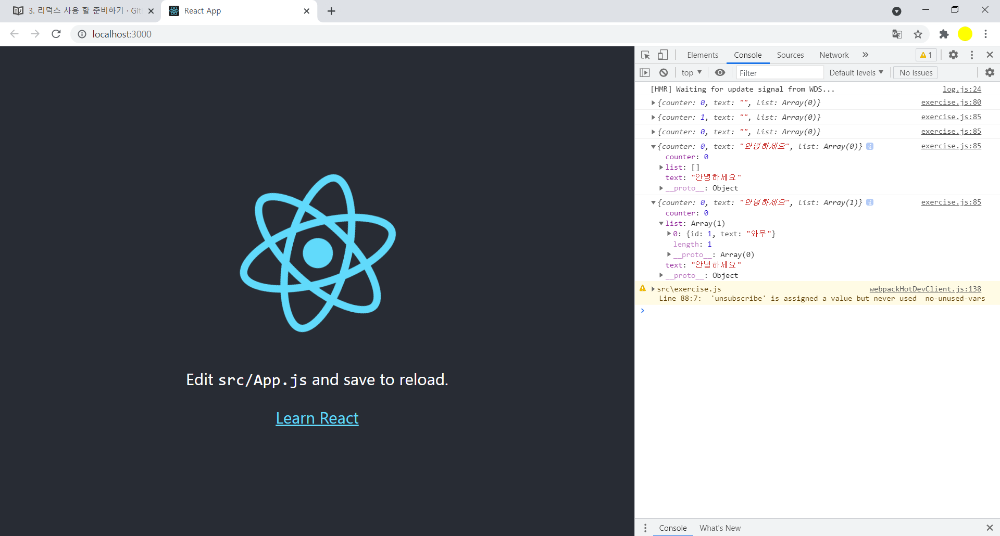
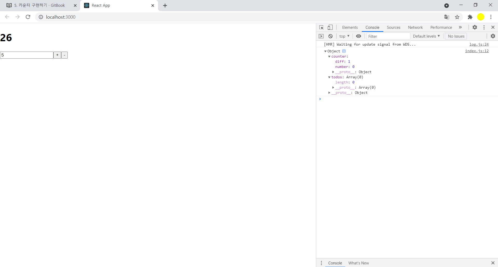
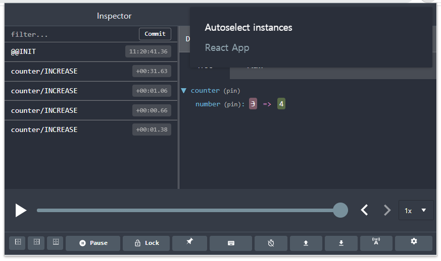

## REDUX KEYWORD


### Action

- 상태에 변화가 필요할때 발생시키는것
- action 객체는 type 필드를 필수적으로 가지고 있어냐 하고 그외 값들은 선택적으로 사용

```react
{
  type: "ADD_TODO",
  data: {
    id: 0,
    text: "리덕스 배우기"
  }
}
```


### Action Creator(생성자)

- 액션을 만드는 함수 파라미터를 받아와서 액션 객체형태로 만들어준다

- 보통 함수앞에 export 키워드를 붙여서 다른 파일에서 불러와서 사용

  

```react
export function addTodo(data) {
  return {
    type: "ADD_TODO",
    data
  };
}

// 화살표 함수로도 가능
export const changeInput = text => ({ 
  type: "CHANGE_INPUT",
  text
});
```


### Reducer

- 변화를 일으키는 함수

- 두가지 파라미터를 받아온다

- 현재의 상태와 전달받은 액션을 참고하여 새로운 상태를 반환(useReducer와 똑같은 형태)

- useReducer와 동일한 형태이나, useReducer에서는 일반적으로 default:부분에 throw new Error('unhandled action')과 같이 에러발생시키지만 redux의 reducer에서는 기존 state를 그대로 반환 하도록 작성해야 한다

- root reducer/sub reducer로 구성가능

  

```react
// 카운터를 위한 reducer
function counter(state, action) {
  switch (action.type) {
    case 'INCREASE':
      return state + 1;
    case 'DECREASE':
      return state - 1;
    default:
      return state;
  }
}
```


### Store

- 한 어플리케이션당 하나의 스토어

- 스토어 안에는 현재의 앱상태와 리듀서가 들어가 있고, 추가적으로 몇가지 내장함수들이 있다

  

### dispatch

- Store의 내장함수중 하나로 액션을 발생시키는것으로 이해하면 됨
- 액션을 파라미터로 전달=> dispatch(action)
- Store는 리듀서 함수를 실행시켜서 해당 액션을 처리하는 로직이 있다면 액션을 참고하여 새로운 상태를 만들어줌


### subscribe

- Store의 내장함수중 하나로 함수형태의 값을 파라미터로 받아옴

- subscribe함수에 특정함수를 전달해 주면, 액션이 디스패치 되었을때마다 전달해준 함수가 호출됨

- 직접 사용하는 일은 별로 없고, react-redux 라이브러리에서 제공하는 connect 함수 또는 useSelector Hook을 사용하여 리덕스 스토어의 상태에 구독

  


## Redux의 세가지 Rule


### 1. 하나의 어플리케이션에는 하나의 Store가 있는걸 원칙으로 한다

- 여러개의 스토어를 사용하는 것이 가능하기는 하지만 권장되지 않음


### 2. 상태는 읽기 전용이어야 한다

- Redux에서 불변성(immutability)을 유지해야 하는 이유는 내부적으로 데이터가 변경되는것을 감지하기 위해 shallow compare로 equality를 체크하기 때문

- object를 비교할때 각각의 attribute를 비교하지 않고 reference를 비교함으로 성능 극대화함

  

### 3. 리듀서는 순수한 함수여야 한다

- 리듀서함수는 이전상태와 액션객체를 파라미터로 받는다

- 이전의 상태는 건들지 않고, 변화를 일으킨 새로운 상태 객체를 만들어서 반환

- 똑같은 파라미터로 호출된 리듀서 함수는 언제나 같은 결과값을 반환해야 한다

- 순수한 함수가 아닐경우 리덕스 미들웨어를 사용

  

### Redux 라이브러리 설치

- npm install redux
- npm install react-redux


### exercise.js

```react
import { createStore } from 'redux';

// createStore는 스토어를 만들어주는 함수입니다.
// 리액트 프로젝트에서는 단 하나의 스토어를 만듭니다.

/* 리덕스에서 관리 할 상태 정의 */
const initialState = {
    counter: 0,
    text: '',
    list: []
  };
 
  /* 액션 타입 정의 */
// 액션 타입은 주로 대문자로 작성합니다.
const INCREASE = 'INCREASE';
const DECREASE = 'DECREASE';
const CHANGE_TEXT = 'CHANGE_TEXT';
const ADD_TO_LIST = 'ADD_TO_LIST';

/* 액션 생성함수 정의 */
// 액션 생성함수는 주로 camelCase 로 작성합니다.
function increase() {
    return {
      type: INCREASE // 액션 객체에는 type 값이 필수입니다.
    };
}

// 화살표 함수로 작성하는 것이 더욱 코드가 간단하기에,
// 이렇게 쓰는 것을 추천합니다.
const decrease = () => ({
    type: DECREASE
});

const changeText = text => ({
    type: CHANGE_TEXT,
    text // 액션안에는 type 외에 추가적인 필드를 마음대로 넣을 수 있습니다.
});

const addToList = item => ({
    type: ADD_TO_LIST,
    item
});

/* 리듀서 만들기 */
// 위 액션 생성함수들을 통해 만들어진 객체들을 참조하여
// 새로운 상태를 만드는 함수를 만들어봅시다.
// 주의: 리듀서에서는 불변성을 꼭 지켜줘야 합니다!

function reducer(state = initialState, action) {
    // state 의 초깃값을 initialState 로 지정했습니다.
    switch (action.type) {
      case INCREASE:
        return {
          ...state,
          counter: state.counter + 1
        };
      case DECREASE:
        return {
          ...state,
          counter: state.counter - 1
        };
      case CHANGE_TEXT:
        return {
          ...state,
          text: action.text
        };
      case ADD_TO_LIST:
        return {
          ...state,
          list: state.list.concat(action.item)
        };
      default:
        return state;
    }
  }

/* 스토어 만들기 */
const store = createStore(reducer);

console.log(store.getState()); // 현재 store 안에 들어있는 상태를 조회합니다.

// 스토어안에 들어있는 상태가 바뀔 때 마다 호출되는 listener 함수
const listener = () => {
  const state = store.getState();
  console.log(state);
};

const unsubscribe = store.subscribe(listener);
// 구독을 해제하고 싶을 때는 unsubscribe() 를 호출하면 됩니다.

// 액션들을 디스패치 해봅시다.
store.dispatch(increase());
store.dispatch(decrease());
store.dispatch(changeText('안녕하세요'));
store.dispatch(addToList({ id: 1, text: '와우' }));


```




## Redux 모듈 만들기

- Redux 모듈: 액션타입, 액션 생성함수, 리듀서가 모두 들어있는 js파일

- ducks구조: 리듀서와 액션관련 코드들을 하나의 파일에 모두 작성하는 구조

- https://github.com/erikras/ducks-modular-redux

  


### index.js

- Provider 컴포넌트를 불러와 App 컴포넌트를 감싸준후, Provider의 props에 store를 넣어줌

```react
import React from 'react';
import ReactDOM from 'react-dom';
import './index.css';
import App from './App';
import reportWebVitals from './reportWebVitals';
//import './exercise'
import { createStore } from 'redux';
import { Provider } from 'react-redux';
import rootReducer from './modules';

const store = createStore(rootReducer); // 스토어를 생성.
//console.log(store.getState()); // 스토어의 상태를 확인.

ReactDOM.render(
  <Provider store={store}>
    <App />
  </Provider>  ,
  document.getElementById('root')
);

// If you want to start measuring performance in your app, pass a function
// to log results (for example: reportWebVitals(console.log))
// or send to an analytics endpoint. Learn more: https://bit.ly/CRA-vitals
reportWebVitals();

```

- Provider로 store를 넣어서 App를 감싸게 되면, 렌더링하는 그 어떤 컴포넌트들은 리덕스 스토어에 접근 가능하게 된다


## 카운터 구현하기

#### 프리젠테이셔널 컴포넌트 만들기

- presentational component : redux store에 직접적으로 접근하지 않고 필요한 값 또는 함수를 props로만 받아와서 사용하는 컴포넌트


###  Counter.js

```react
import React from 'react';

function Counter({ number, diff, onIncrease, onDecrease, onSetDiff }) {
  const onChange = e => {
    // e.target.value 의 타입은 문자열이기 때문에 숫자로 변환해주어야 합니다.
    onSetDiff(parseInt(e.target.value, 10));
  };
  return (
    <div>
      <h1>{number}</h1>
      <div>
        <input type="number" value={diff} min="1" onChange={onChange} />
        <button onClick={onIncrease}>+</button>
        <button onClick={onDecrease}>-</button>
      </div>
    </div>
  );
}

export default Counter;
```

- presentational component에선 주로 UI를 선언하는것에 집중하며, 필요한 값들이나 함수는 props로 받아와서 사용하는 형태로 구현한다

  

#### 컨테이너 컴포넌트 만들기

- container component : redux store의 상태를 조회하거나, 액션을 dispatch 할 수 있는 컴포넌트
- html태그들을 사용하지 않고 다른 프리젠테이셔널 컴포넌트들을 불러와서 사용한다


#### CounterContainer.js

```react
import React from 'react';
import { useSelector, useDispatch } from 'react-redux';
import Counter from '../components/Counter';
import { increase, decrease, setDiff } from '../modules/counter';

function CounterContainer() {
  // useSelector는 리덕스 스토어의 상태를 조회하는 Hook입니다.
  // state의 값은 store.getState() 함수를 호출했을 때 나타나는 결과물과 동일합니다.
  const { number, diff } = useSelector(state => ({
    number: state.counter.number,
    diff: state.counter.diff
  }));

  // useDispatch 는 리덕스 스토어의 dispatch 를 함수에서 사용 할 수 있게 해주는 Hook 입니다.
  const dispatch = useDispatch();
  // 각 액션들을 디스패치하는 함수들을 만드세요
  const onIncrease = () => dispatch(increase());
  const onDecrease = () => dispatch(decrease());
  const onSetDiff = diff => dispatch(setDiff(diff));

  return (
    <Counter
      // 상태와
      number={number}
      diff={diff}
      // 액션을 디스패치 하는 함수들을 props로 넣어줍니다.
      onIncrease={onIncrease}
      onDecrease={onDecrease}
      onSetDiff={onSetDiff}
    />
  );
}

export default CounterContainer;
```


#### App.js

```react
import React from 'react';
import CounterContainer from './containers/CounterContainer';

function App() {
  return (
    <div>
      <CounterContainer />
    </div>
  );
}

export default App;
```




#### 

#### Presentational Compent & Container Component

- https://medium.com/@dan_abramov/smart-and-dumb-components-7ca2f9a7c7d0
- 리덕스 창시자 Dan Abramov 가  Presentational component와 container component를 소개하면서 컴포넌트를 구분지어서 진행하는것이 당연시 됨
- 꼭 이렇게 분리할 필요없다고 Dan Abramov도 명시하였기 때문에 편하다고 생각되는 방식을 선택하면 됨


## 리덕스 개발자 도구 적용하기

#### 크롬 웹스토어 Redux Dev Tools설치

- https://chrome.google.com/webstore/detail/redux-devtools/lmhkpmbekcpmknklioeibfkpmmfibljd

#### 프로젝트에 redux-devtools-extension 설치

- npm install redux-devtools-extension


### index.js 수정

```react
import React from 'react';
import ReactDOM from 'react-dom';
import './index.css';
import App from './App';
import reportWebVitals from './reportWebVitals';
//import './exercise'
import { createStore } from 'redux';
import { Provider } from 'react-redux';
import rootReducer from './modules';
import { composeWithDevTools } from 'redux-devtools-extension'; // 리덕스 개발자 도구

// composeWithDevTools 를 사용하여 리덕스 개발자 도구 활성화
const store = createStore(rootReducer, composeWithDevTools()); // 스토어를 만듭니다.
console.log(store.getState()); // 스토어의 상태를 확인해봅시다.

ReactDOM.render(
  <Provider store={store}>
    <App />
  </Provider>,
  document.getElementById('root')
);

// If you want to start measuring performance in your app, pass a function
// to log results (for example: reportWebVitals(console.log))
// or send to an analytics endpoint. Learn more: https://bit.ly/CRA-vitals
reportWebVitals();

- 크롬의 확장프로그램에서 ReduxDevTools선택

```


