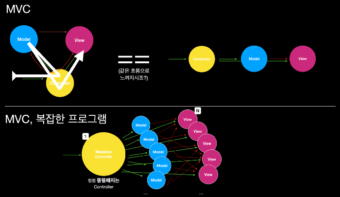

# 패턴?

## 디자인 패턴

### 정의

프로그램 개발에서 자주 나타나는 과제를 해결하기 위한 방법 중 하나로, 소프트웨어 개발과정에서 발견된 Know-How를 축적하여 이름을 붙여 이후에 재사용하기 좋은 형태로 특정 규약을 묶어서 정리한 것.

### 사용하는 이유

- 요구사항 변경에 대한 Source Code 변경을 최소화
- 여러 사람이 같이 하는 팀 프로젝트에서 범용적인 코딩 스타일을 적용하기 위함
- 인수인계 할 때 이해하기 직관적임

## 프레임워크

### 정의

비기능적 요구사항(성능, 보안, 확장성, 안정성 등)을 만족하는 구조와 구현된 기능을 안정적으로 실행하도록 제어해주는 잘 만들어진 구조의 라이브러리의 덩어리. 애플리케이션들의 최소한의 공통점을 찾아 하부 구조를 제공함으로써 개발자들로 하여금 시스템의 하부 구조를 구현하는데 들어가는 노력을 절감하게 해 줌.

### 사용하는 이유

- 비기능적인 요소들을 초기 개발 단계마다 구현할 시간을 없애준다.
- 기능적인 요구사항에 집중할 수 있다.
- 반복적으로 발견되는 문제를 해결하기 위한 특화된 Solution을 제공한다.

결국 디자인 패턴이나 프레임워크 둘 다 코드를 작성함에 있어 어떠한 가이드라인을 제공하여 프로그램의 작성 흐름을 비슷하게 만드는 것.

사람들의 잘 짜여진 가이드라인을 따라 비슷한 스타일의 코드를 작성하게 되면, 개발자 본인도 프로그램의 작성/ 유지 보수에 도움이 될 것이고 새로운 사람과 일을 하게 되더라도 그 코드의 패턴에 대해 서로 잘 알고 있다면 코드 설명으로 낭비하는 시간을 많이 단축할 수 있어서 사용합니다.

이와 비슷하게 개발을 진행 할 때 코드가 한 곳에 얽히는 것을 방지하기 위해(역할별로 코드를 분리하기 위해) 만들어진 여러가지 패턴들에 대해서 알아보겠습니다.

# 패턴 비교

패턴이란 것 없이 프로그램을 만들 때도 아마 처음에는 아무 문제 없이 잘 작동했을 것 입니다.

하지만 프로그램 몸집이 점점 커져서 data의 양도 많아지고 가공하는 logic도 복잡해진다면

결국에는 코드가 뒤죽박죽 되어 이해할 수 없게 되는 특이점이 반드시 오겠죠.

**화면에 나오는 것, 처리되는 것, 데이터를 잘 나누어서 처리를 해보자** 라는 발상에서 나온 것이 알아볼 패턴들 입니다.

소개되는 패턴들의 핵심은

> 화면에 보여주는 로직과 실제 데이터가 처리되는 로직을 분리

한다는 것 입니다.

## 1. MVC (Model + View + Controller)

### 구분

1. Model : 프로그램에서 사용되는 실제 데이터 및 데이터 조작 로직을 처리
2. View: 사용자에게 제공되어 보여지는 UI 부분
3. Controller: 사용자의 입력을 받고 처리하는 부분

### 동작

1. Controller로 사용자의 Input이 들어옵니다.
2. Controller는 사용자 Input(action)에 알맞게 Model을 업데이트합니다.
3. Model은 가공된 데이터를 보여줄 View를 선택해서 화면에 보여주게 됩니다. (여러개 선택 가능)

### 단점

다수의 View와 Model이 Controller를 통해 복잡하게 연결될 수 있기 때문에 Controller가 뚱뚱해지게 되는Massive ViewController(대규모 MVC 어플리케이션)가 되어버립니다.

View와 Controller가 라이프사이클에 강하게 연결되어있고, 더불어 Controller를 통해 View와 Model간에도 관계가 복잡하게 연결되어있어서 수정시 테스트가 힘들고, 파악이 어렵기 때문에 여러 Side-Effect를 불러오게 되는 문제점이 있습니다.

이런 View-Model의 강한 의존성을 해결하기 위해 아래의 패턴들이 파생되었습니다.

## 1. MVP (Model + View + Presenter)

### 구분

Controller가 Presenter 바뀌었습니다.

Presenter: View에서 요청한 정보를 Mode로 부터 가공해서 전달해준다.

### 동작

Input을 View에서 받아 필요한 정보를 Presenter에 요구하고 받아옵니다.

View와 Model의 직접적으로 참조하지 않기 때문에 View-Model의 의존성이 없어졌습니다.

### 단점

View-Presenter 의존성이 생겼습니다!...

## 3. MVVM(Model + View + ViewModel)

### 구분

이번에는 ViewModel이 대신 들어왔습니다.

ViewModel: View를 표현하기 위해 만들어진 View를 위한 Model

### 동작

1. View에 입력이 들어오면 Command 패턴으로 ViewModel에 명령을 합니다.
2. ViewModel은 필요한 데이터를 Model에 요청 합니다.
3. Model은 ViewModel에 필요한 데이터를 응답 합니다.
4. ViewModel은 응답 받은 데이터를 가공해서 저장 합니다.
5. View는 ViewModel과의 Data Binding으로 인해 자동으로 갱신 됩니다.

view model - model 은 1대1 매칭 되어 있어 ViewModel이 바뀌게 되면 자동으로 view가 갱신됩니다.

Command 패턴과 Data Binding 패턴을 사용하기 때문에 Model-ViewModel의 의존성은 없습니다.

### 단점

구조를 구상하기 힘들다.

## 4. Flux

페이스북에서 MVC의 한계를 극복하기 위해 만들었다.
[https://bestalign.github.io/2015/10/06/cartoon-guide-to-flux/](https://bestalign.github.io/2015/10/06/cartoon-guide-to-flux/)

### 5. Redux

Flux와 Redux의 차이점은 Redux의 3가지 원칙에서 알 수 있습니다.

1. App의 모든 상태는 하나의 Store에 저장된다.
2. 상태는 읽기 전용이다.(불변성)
3. 변화는 순수 함수로만 작성되어야 한다.(함수형 프로그래밍)

### 단점

1. 무조건 하나의 스토어를 강제함으로써 뷰의 데이터 접근 방식을 어렵게 만듦
2. 디스패쳐를 통한 유연한 업데이트 방식을 포기함
3.

### 장점

불변 데이터 컨셉, 순수함수, 싱글 스토어를 통해 side-effect 없는 업데이트를 강제한다.

[https://www.huskyhoochu.com/flux-architecture/](https://www.huskyhoochu.com/flux-architecture/)
